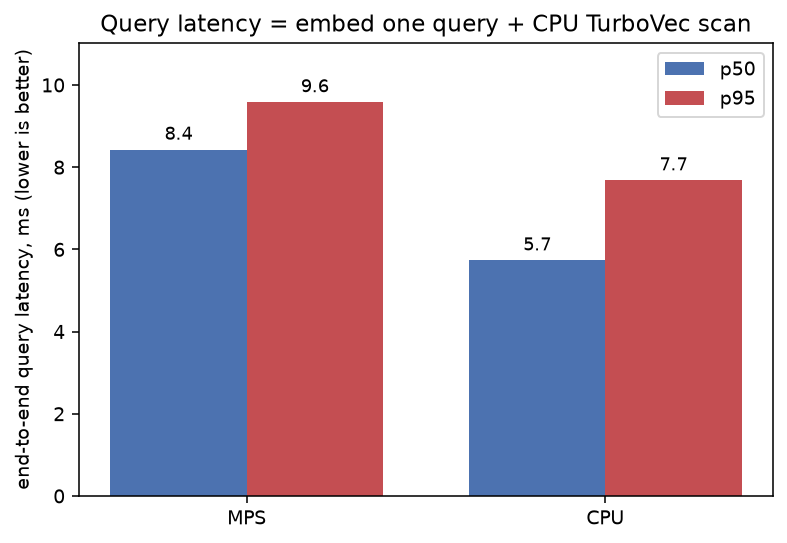

<h1 align="center">LodeDB</h1>
<p align="center">🔥 the <b>fastest</b> and <i>most compact</i> embedded vector database in the world 🌍</p>

[](LICENSE)
[](pyproject.toml)

*Built by [Egoist Machines, Inc.](https://egoistmachines.com) - efficient full-stack infrastructure
for reliable AI systems.*

LodeDB is great for local RAG; it's _extremely fast_, exact, in-process, and on-disk. We're the **best drop-in** durable memory backend for **LangChain, LlamaIndex, and mem0**: the most
compact on disk, the fastest per single query, GPU-accelerated for batched search, and durable in
about a millisecond per write. Point any of them at LodeDB instead of its default store. Over 17.5k
documents, per framework default:

| vs the framework's default store | LangChain `InMemoryVectorStore` | LlamaIndex `SimpleVectorStore` | mem0 Qdrant |
|---|---|---|---|
| On-disk footprint | **13.6× smaller** (15 vs 199 MB) | **9.9× smaller** (15 vs 145 MB) | **5.7× smaller** (12 vs 70 MB) |
| Single-query p50 (CPU) | **~600× faster** (0.45 vs 272 ms) | **~620× faster** (0.44 vs 272 ms) | **~46× faster** (0.59 vs 27 ms) |
| Batched retrieval, 64 (GPU) | **~2,880×** (11,049 vs ~4 qps) | **~3,050×** (11,297 vs ~4 qps) | **~139×** (5,084 vs 36 qps) |
| Durable add of one memory | **~26,000× faster** (0.26 ms vs 6.9 s) | **~57,000× faster** (0.26 ms vs 14.8 s) | **0.28** vs 0.44 ms (both sub-ms) |

Among embedded stores, LodeDB has the smallest footprint and the fastest single-query and batched
search, and its durable add leads the fastest lazy-append stores
(sqlite-vec, qdrant) too:

| **embedded stores** | **durable add p50** | **single-query p50** | **batch-64/query** | **memory footprint** |
| --- | ---: | ---: | ---: | ---: |
| **LodeDB** | **0.26 ms** | **0.45 ms** | **0.09 ms** | **15 MB** |
| sqlite-vec | 0.42 ms | 26.8 ms | 24.7 ms | 96 MB |
| qdrant | 0.48 ms | 13.9 ms | 14.2 ms | 81 MB |
| pgvector | 2.29 ms | 35.1 ms | 37.0 ms | 48 MB |
| lancedb | 3.36 ms | 10.6 ms | 10.3 ms | 35 MB |
| chroma | 5.92 ms | 3.35 ms | 3.26 ms | 144 MB |

All numbers are reported as the mean of 3 independent runs on a L40S server. [Full benchmark, all backends
(FAISS, Chroma, Qdrant, LanceDB, sqlite-vec, pgvector), and method.](benchmarks/memory_integrations)

> **Like what you see?** Point the coding assistant in your project at
> [egoistmachines.com/lodedb/install-agent](https://egoistmachines.com/lodedb/install-agent)
> and it will migrate your existing store onto the LodeDB backend.

Most embedded vector databases stop at the CPU. LodeDB runs the same on-disk index **on the
GPU** when you have one: batched search hits *24k queries/sec on an A10 and 50k qps on an L40S*,
2.8× to 4.8× the all-CPU ceiling, with recall unchanged. It also persists changed rows
incrementally, so a commit stays **sub-millisecond even at 1M vectors**.

- **GPU-resident batch search**: an fp16 copy of the index lives on the GPU, scored with a
  tiled GEMM plus a streaming top-k (`[gpu]`, Linux/CUDA). [How it works](#gpu-resident-index).
- **O(changed) persistence**: commits only the rows that changed, 173× to 1,308× faster
  than a full rewrite. [How it works](#delta-persistence).
- **Compact storage**: the MIT [TurboVec](#turbovec) core packs vectors into 2/4-bit codes
  and scans them with SIMD CPU kernels; retained document text is stored zstd-compressed
  (on by default, set at create time with `compression=`).
- **In-process, on-disk** (`.tvim`/`.tvd`/`.jsd`): no daemon, no account, no API key.
- **Safe concurrency**: one writer and many lock-free readers per path; every commit is
  crash-atomic and rolls back to the last committed state on failure, never a torn store.
  [How it works](#concurrency--durability).
- **Private by default**: text, ids, and vectors stay local; telemetry is metrics-only
  (counts, bytes, latency), never raw payloads.
- **Local embeddings**: ONNX Runtime by default (lower per-query latency), with a PyTorch
  `sentence-transformers` fallback; runs on CPU, CUDA, or MPS. Pick with `embedding_runtime=`.
- **Multimodal**: index images and text in one shared CLIP space (`model="clip"`) for
  cross-modal search, or bring your own vectors from any model.
  [How it works](#multimodal--bring-your-own-vectors).
- **Batteries included**: a `lodedb` CLI, a loopback/private-network dev server, an
  [MCP server](#use-as-an-mcp-server), LangChain, LlamaIndex, and mem0 adapters
  (`VectorStore`s, plus a LlamaIndex `PropertyGraphStore`), and a one-line
  [PrivateGPT](https://github.com/zylon-ai/private-gpt) vector-store provider built on the
  LlamaIndex adapter.
- **Migrate onto LodeDB**: `lodedb migrate` moves an existing LangChain, LlamaIndex, or mem0
  store, or a direct provider such as pgvector, onto a local LodeDB path along a
  plan-first, non-destructive inspect/plan/dry-run/run/validate path.
  [Migration guide](docs/integrations.md#migrating-onto-lodedb).

> 🏢 **Enterprise** The LodeDB core is Apache-2.0 and free to use. Enterprise licensing is
> available for commercial support, managed and at-scale serving, and on-prem / BYOC
> deployment. Contact [sales@egoistmachines.com](mailto:sales@egoistmachines.com).

## Install

```bash
pip install lodedb
```

That's it. Prebuilt wheels cover Linux, macOS (Apple Silicon and Intel), and Windows on
Python 3.11+, and bundle the TurboVec (Rust) core, so there's nothing to compile. Confirm
the install with `lodedb doctor`. Optional extras:

```bash
pip install "lodedb[gpu]"                            # GPU-resident scan (Linux/CUDA)
pip install "lodedb[image]"                          # image + text (CLIP) embedding (model="clip")
pip install "lodedb[mcp,langchain,llama-index,mem0]" # MCP server + LangChain/LlamaIndex/mem0 adapters
pip install "lodedb[onnx-export]"                    # export ONNX for a custom model (Optimum); presets need no export
```

Using LodeDB as memory for a coding assistant? After installing the `mcp` extra, register its
server in one step (details under [Use as an MCP server](#use-as-an-mcp-server)):

```bash
lodedb mcp install --client claude-code        # or: claude-desktop | cursor | lm-studio | codex | all
```

<details>
<summary><b>Windows: NVIDIA GPU embeddings</b></summary>

On Windows, PyPI serves the CPU-only PyTorch build by default, so `pip install lodedb` (and
`uv`) leave embeddings on the CPU even on a CUDA machine, and no package metadata can override
which torch wheel pip resolves. `lodedb doctor` detects this and prints the fix; `lodedb doctor
--fix` reinstalls the CUDA build for you:

```bash
lodedb doctor          # flags a CPU-only PyTorch on Windows and prints the command
lodedb doctor --fix    # reinstalls the CUDA build so embeddings use your NVIDIA GPU
```

Or reinstall manually, picking the index for your CUDA version (`cu121`, `cu124`, ...) from the
[PyTorch install guide](https://pytorch.org/get-started/locally/):

```bash
pip install torch --force-reinstall --no-deps --index-url https://download.pytorch.org/whl/cu121
uv pip install torch --reinstall --index-url https://download.pytorch.org/whl/cu121   # with uv
```

This is Windows-only: the default Linux PyPI wheel already bundles CUDA, and macOS uses CPU
or MPS.

</details>

<details>
<summary><b>Build from source</b> (contributors, or a platform without a wheel)</summary>

Needs a Rust toolchain and a CBLAS provider (Accelerate on macOS, `libopenblas-dev` on
Linux). [uv](https://docs.astral.sh/uv/) builds and bundles the core for you:

```bash
git clone https://github.com/Egoist-Machines/LodeDB && cd LodeDB
uv sync                                 # builds + bundles the TurboVec core via maturin
uv sync --extra mcp --extra langchain --extra llama-index --extra mem0  # + MCP server, adapters
uv sync --extra gpu                                                     # + GPU-resident scan (Linux/CUDA)
```

Run with `uv run` (e.g. `uv run lodedb doctor`).

</details>

## Quickstart

```python
from lodedb import LodeDB

db = LodeDB(path="./data", model="minilm")   # "minilm" (fast) | "bge" (quality) | "clip" (image+text)

fox = db.add("the quick brown fox jumps", metadata={"topic": "animals"})
db.add("a lazy dog sleeps all day", metadata={"topic": "animals"})

for score, doc_id, meta in db.search("fox", k=5):
    print(score, doc_id, meta)

for hits in db.search_many(["fox", "dog"], k=5):   # batched; the GPU can serve this
    print([(h.score, h.id, h.metadata) for h in hits])

# filter by metadata: exact match, plus $gt/$gte/$lt/$lte/$in/$nin/$exists and $and/$or/$not
db.search("fox", k=5, filter={"topic": "animals"})                      # bare scalar = exact
db.search("fox", k=5, filter={"$or": [{"topic": "animals"}, {"year": {"$gte": 2020}}]})

# hybrid search: vector recall plus exact lexical matches the embedding misses
db.search("E1234", k=5, mode="hybrid")     # surfaces error codes, serials, dates in the body

db.get(fox)     # -> "the quick brown fox jumps"  (text retained by default)
db.persist()    # durable .tvim/.tvd/.jsd snapshot; replays on reopen
```

Reopen with `LodeDB(path="./data")`; no migration step. Original text is kept in a
`.tvtext` sidecar for `db.get`; pass `store_text=False` to keep none. Presets are `minilm`
(384-dim), `bge` (768-dim), and `clip` (512-dim, image+text), with weights pulled from Hugging
Face on first use. More in [`examples/`](examples/).

Need to read a store another process is writing to? Open it read-only. It takes no writer
lock, so it never blocks on (or is blocked by) the writer:

```python
reader = LodeDB.open_readonly("./data")   # or LodeDB(path="./data", read_only=True)
reader.search("fox", k=5)                 # reads a committed snapshot
reader.add("nope")                        # raises ReadOnlyError
```

## Hybrid search

Vector search alone misses exact tokens the embedding does not capture: error codes
(`E1234`), serial numbers (`ABC-123`), dates (`2024-01-15`). Pass `mode="hybrid"` to run a
lexical BM25 ranker alongside the vector scan and fuse the two ranked lists with Reciprocal
Rank Fusion. The lexical ranker matches those tokens exactly, so a document whose body carries
the code is recovered even when the embedding ranks it nowhere near the top.

```python
db.add("the turbine tripped and reported fault code E1234 overnight", metadata={"unit": "t3"})

db.search("E1234", k=5)                 # mode="vector" (default): may miss the exact code
db.search("E1234", k=5, mode="hybrid")  # BM25 + RRF: surfaces it in the top-k
db.search("E1234", k=5, mode="lexical") # BM25 ranking alone, no vector scan
```

<details>
<summary><b>Prerequisites</b></summary>

`mode="hybrid"` and `mode="lexical"` build a BM25 index over your text, so they need a text
source enabled when you open the database. `mode="vector"` (the default) needs nothing.

| Mode | Enable | Source of the BM25 index |
| --- | --- | --- |
| `"vector"` (default) | nothing | not used |
| `"hybrid"`, `"lexical"` | `store_text=True` (on by default) | rebuilt in memory from the retained raw text |
| `"hybrid"`, `"lexical"` | `index_text=True` | a durable on-disk postings store, no raw text required |

Either source is enough and you can enable both. `store_text=True` is the default, so hybrid
works out of the box. With neither source enabled, a hybrid or lexical query raises a clear,
actionable error rather than silently degrading.
</details>

<details>
<summary><b>How it works</b></summary>

A `filter` constrains both rankers, so `mode="hybrid"` with a filter returns the true top-k of
the matching subset. The vector half of a hybrid query runs on the same scan as `mode="vector"`,
including the GPU-resident batch scan that serves `search_many`; only the BM25 ranking and the
fusion run on the CPU, and the vector kernel and on-disk format are untouched. The serving BM25
index lives in memory and is maintained incrementally: a small mutation folds just the changed
chunks into the existing index, so a single `add` never forces a full re-tokenization.
</details>

<details>
<summary><b>Durable lexical index (`index_text=True`)</b></summary>

By default the BM25 index is rebuilt from the retained raw text, so it needs `store_text=True`
and is re-tokenized on the first hybrid query after opening. Pass `index_text=True` to persist
it instead: each document's per-chunk terms are captured at `add` time into a dedicated `.tvlex`
sidecar (a base plus a `.lxd` delta journal, committed O(changed) per write), so hybrid and
lexical search survive a reopen rebuilt straight from the persisted terms, with no
re-tokenization and without retaining the raw text at all. The `.tvlex` sidecar holds
payload-derived terms only and, like the raw-text sidecar, never reaches the redacted artifacts
or telemetry. The tokenizer lowercases and splits on punctuation but keeps code-like tokens
whole, so `ABC-123` and `2024-01-15` stay findable as single tokens. Reopen with the same
`index_text` value you wrote with.

```python
db = LodeDB(path="./data", index_text=True, store_text=False)  # durable lexical index, no raw text
db.add("the turbine tripped and reported fault code E1234 overnight")
db.close()

reopened = LodeDB(path="./data", index_text=True, store_text=False)
reopened.search("E1234", k=5, mode="hybrid")  # works after reopen, rebuilt from persisted terms
```
</details>

## Multimodal & bring-your-own vectors

The storage and scan are modality-agnostic: TurboVec stores any normalized float32
vector, so an image, audio, or video embedding is indexed and scanned exactly like a
text one. There are two ways to use that.

Bring your own vectors. Open a vector-only index at your dimension and pass the
embeddings you already computed with any model (CLIP, SigLIP, ImageBind, an audio or
video encoder, a hosted API). No embedding model is bundled on this path:

```python
db = LodeDB.open_vector_store("./media", vector_dim=512)
db.add_vectors(image_vector, id="img-001", metadata={"path": "photos/img-001.jpg"})
db.search_by_vector(query_vector, k=10)
```

Or use the built-in `clip` preset for image and text in one shared space, so a text
query retrieves images and an image query retrieves images and text. It rides the base
sentence-transformers stack and adds only Pillow (`pip install 'lodedb[image]'`):

```python
db = LodeDB("./gallery", model="clip")            # downloads clip-ViT-B-32 on first use
db.add_image("photos/beach.jpg", metadata={"path": "photos/beach.jpg"})
db.search("a beach at sunset", k=5)               # text -> image, cross-modal
db.search_by_image("photos/beach.jpg", k=5)       # image -> image
```

The raw image is never stored; keep it on disk and put its path in `metadata`. Keep one
embedding model per index (scores are only comparable within one space); the model
identity is pinned and re-enforced on reopen. To hold several encoders side by side, use
`LodeCollection` named spaces, and pass `embedder=` to drive an index with your own
model. See [`docs/multimodal.md`](docs/multimodal.md).

## Late-interaction (multi-vector) retrieval

For visual-document RAG, ColPali / ColQwen style models encode a page as a *set* of
patch vectors and rank with MaxSim (sum over query tokens of the best patch match),
rather than pooling to one vector. `LodeLateInteractionIndex` runs this on the
bring-your-own-vectors path with no engine change: each document is one row holding
its whole patch matrix, and an unfiltered query is answered by an exact resident
scan (the corpus scored in one GEMM plus a segmented max) that returns the true
top-k in a few milliseconds on thousands of pages; filtered queries score the
matching subset exhaustively and over-budget corpora stream from disk (both exact).

```python
from lodedb import LodeLateInteractionIndex

idx = LodeLateInteractionIndex("./pages", dim=128)        # bring your own encoder
idx.add_document("report-p1", page_patches, metadata={"file": "report.pdf"})
hits = idx.search(query_tokens, k=5)                       # [(score, doc_id, metadata), ...]
```

The encoder stays bring-your-own (ColPali / ColQwen weights are multi-GB). Patch
matrices are stored at `storage="float32"` (default, fastest query and bit-exact),
`"float16"` (near-exact, half the size), or `"int8"` (~4x smaller); the choice
persists with the index. See [`docs/late-interaction.md`](docs/late-interaction.md).

## GPU-resident index

With the `[gpu]` extra on a CUDA host, LodeDB reconstructs the compact index into an fp16
matrix resident on the GPU and scores batched `search_many` with a tiled GEMM plus a
streaming top-k. It is opt-in and lazy: single queries, non-CUDA hosts, and GPU-memory
rejection fall back to the CPU scan, which stays the source of truth.

GPU throughput climbs with batch size while the CPU scan is flat. Same 4-bit index
(d=1536, 100K), same host, only the scoring step differs. Crossover is around batch 50:

| query batch | A10 GPU | L40S GPU |
|---:|---:|---:|
| 1 | 261 q/s | 432 q/s |
| 16 | 3,531 | 5,562 |
| 64 | 11,463 | 18,175 |
| 256 | 19,998 | 39,449 |
| 1024 | **24,037** | **50,326** |

Vanilla TurboVec CPU (all threads) on the same boxes: 8,497 q/s (A10 host), 10,420 q/s
(L40S host). At batch 1024 the GPU is 2.8× / 4.8× that, and it scales with GPU class.


Recall is unchanged: the GPU scores the exact 4-bit reconstruction, so R@1 tracks the CPU
scan across datasets and bit-widths, and edges ahead on GloVe-200 where quantization error
is largest.


Other in-process vector databases stay CPU-bound. Alibaba's
[zvec](https://github.com/alibaba/zvec) reports about 8.4k q/s (VectorDBBench, 16-vCPU CPU,
Cohere 768-dim): the same class as the TurboVec CPU scan, and a different regime from ours,
so read it as the CPU-class baseline. The GPU-resident path is what clears it.

**Scope.** GPU search is Linux/CUDA-only and opt-in (`[gpu]`). macOS scans on the CPU by
default; a first-class opt-in MPS exact scan exists (`LODEDB_MPS_DIRECT_TURBOVEC`) but NEON
stays the default. On the measured M1 it was slower than NEON at every batch size; newer Apple
GPUs should be re-measured before any default change. See [docs/benchmarks.md](docs/benchmarks.md) and
[docs/architecture.md](docs/architecture.md).

## Delta persistence

Most embedded indexes rewrite the whole file on every change (O(N)). LodeDB writes only the
rows that changed (O(changed)), so a 1,000-row commit stays sub-millisecond at any size:

| corpus | full rewrite | delta export | speedup |
|---:|---:|---:|---:|
| 100K | 42.4 ms | 0.25 ms | 173× |
| 500K | 190.4 ms | 0.24 ms | 782× |
| 1M | 404.9 ms | 0.31 ms | **1,308×** |


The GPU path makes reads fast; the delta makes writes cheap. The on-disk format stays a
plain snapshot that replays on reopen.

The opt-in raw-text store (`store_text=True`) is journaled the same way: an incremental commit
appends a small `.txd` text delta instead of rewriting the whole `document_id -> text` map, so
enabling text retrieval keeps commits O(changed) too. Isolated, the per-commit text write drops
from a full-map rewrite (~57 ms at 20K docs, ~244 ms at 80K) to a flat **~0.7 ms** regardless of
corpus size.

And the rest of an incremental `add()` is O(changed) too: a single-doc update no longer rebuilds
the whole index layout or rewrites the full text map on the commit path, so write latency stays
flat as the corpus grows instead of climbing with it.

## Benchmarks

All artifacts are metrics-only (counts, bytes, latency), never payloads. Full methodology
and the complete figure set are in [docs/benchmarks.md](docs/benchmarks.md); each
[benchmarks/](benchmarks/) folder has a README and a one-line reproduction command.

Local is the common case. On an Apple M1 (MiniLM, 20K docs) the CPU scan is ~0.25 ms p50,
and end-to-end single-query latency is 5.7 ms p50.



## CLI

```bash
lodedb doctor      # capability report: embedding / GPU / TurboVec backend
lodedb index ...   # build / add to an on-disk index
lodedb query ...   # search
lodedb serve       # dev server (127.0.0.1 by default; private LAN only, no auth)
lodedb mcp         # stdio MCP server for agent memory
lodedb benchmark   # local, metrics-only benchmark
```

## Use as an MCP server

LodeDB ships a [Model Context Protocol](https://modelcontextprotocol.io) server, so an agent
can use a local on-disk database as long-term memory or a RAG store. It runs over stdio, adds
no storage logic of its own, and your data stays on the machine. Install the extra and point
your host at `lodedb mcp`:

```bash
pip install "lodedb[mcp]"

# for coding assistant:
lodedb mcp install --client claude-code  # or: claude-desktop | cursor | lm-studio | codex | all
```

It exposes `lodedb_add`, `lodedb_search`, `lodedb_remove`, and `lodedb_stats`, plus
`lodedb_get` when text is available. `lodedb_search` returns each hit's stored text alongside
the score, id, and metadata, so a model can rank and answer in a single call rather than
chaining a follow-up lookup. It runs [hybrid search](#hybrid-search) (BM25 lexical + vector,
fused with RRF) by default when text is retained, so exact tokens like error codes and serials
surface next to semantic matches; with no text retained it falls back to a vector scan. Start
the server with `--exclude-text` to return metrics only (this also withdraws `lodedb_get`), or
`--no-store-text` to keep no text on disk at all. `lodedb_stats` is always metrics-only and raw
query text never leaves the process.

### One command install

`lodedb mcp install` writes the correct entry to a client's config for you, so you do not have to
find the file or hand-write the JSON/TOML:

```bash
lodedb mcp install --client claude-code        # or: claude-desktop | cursor | lm-studio | codex | all
lodedb mcp install --client cursor --path ./data --model bge
```

It resolves the launch command for your environment, so `command` and `args` are correct even when
`lodedb` is not on `PATH` (it falls back to the `uv run --project ...` form, then an absolute path to
the entry point), and it resolves `--path` to an absolute path so the server opens the right
directory wherever the client starts it. The edit is idempotent (an existing `lodedb` entry is
updated, never duplicated) and never touches other servers in the file. It passes through the same
options as `lodedb mcp` (`--path`, `--model`, `--device`, `--exclude-text`, `--no-store-text`);
`--dry-run` prints the entry and target file without writing, and `lodedb mcp uninstall --client
<client>` removes it again. Override the config location with `--config <path>` (Claude Desktop and
LM Studio paths differ per OS), and use `--project <dir>` to write Cursor's project-level
`.cursor/mcp.json`. For Claude Code it runs `claude mcp add`; for the others it edits the config file
directly.

<details>
<summary><b>Register by hand</b> (Claude Code, Claude Desktop, Cursor, LM Studio, Codex)</summary>

The `lodedb` command must be on the host's `PATH`; if you installed into a virtual environment
(including a `uv` project) where it isn't, use the `uv run` form at the bottom.

**Claude Code, Claude Desktop, Cursor, LM Studio**: add the stdio entry to the host's MCP
config (`claude_desktop_config.json`, `.cursor/mcp.json`, or LM Studio's `mcp.json`), or run
`claude mcp add lodedb -- lodedb mcp --path ./data`:

```json
{ "mcpServers": { "lodedb": { "command": "lodedb", "args": ["mcp", "--path", "./data"] } } }
```

**Codex**: add to `~/.codex/config.toml`:

```toml
[mcp_servers.lodedb]
command = "lodedb"
args = ["mcp", "--path", "./data"]
```

**From a virtual environment (uv)**, when `lodedb` is not on `PATH`:

```json
{ "mcpServers": { "lodedb": { "command": "uv",
  "args": ["run", "--project", "/path/to/LodeDB", "lodedb", "mcp", "--path", "/path/to/data"] } } }
```

See [`examples/mcp_config.json`](examples/mcp_config.json) for a copy-paste starting point.

</details>

## Concurrency & durability

- **Single writer, many readers, per path.** One handle holds the path open for *writing* at
  a time (an exclusive OS advisory lock); a second writer waits for it to close, then fails
  fast (`ConcurrentWriterError`) after `LODEDB_PERSIST_LOCK_TIMEOUT` (default 30s).
  **Read-only** handles (`LodeDB.open_readonly(path)` or `read_only=True`; used by
  `lodedb query`/`get`) take *no* lock, so they read one consistent committed snapshot **while**
  a writer is open. They just don't auto-see the writer's in-flight changes (no live
  cross-process refresh). Within one process the engine serializes operations under an
  in-process lock, so the threaded `lodedb serve` safely shares one handle.
- **Crash-atomic commits.** A commit spans several files, but it is sealed by atomically
  swapping one `<key>.commit.json` root pointer over generation-addressed artifacts, so a
  crash mid-commit rolls back to the last committed generation on reopen (never a torn,
  half-applied store) and readers always load one consistent generation.
- **Durability is `fast` by default.** Commits are *atomic* but not fsync'd. Pass
  `durability="fsync"` (or `--durability fsync` / `LODEDB_DURABILITY=fsync`) to fsync each
  file and its directory on commit for power-loss durability, at some commit-throughput cost.
- **WAL commit by default for low-latency durable writes.** Each `add`/`remove` appends one
  framed record to a `<key>.wal` log and a full generation is checkpointed periodically, so a
  durable single add costs roughly an order of magnitude less than publishing a whole generation
  per write, into the sqlite-vec/qdrant range (see the comparison up top). The WAL is replayed
  crash-atomically on reopen (a half-written trailing record is discarded), every writable open
  folds it into a clean committed generation, and `close()`/`persist()` checkpoint it. WAL is
  single-writer: a concurrent `open_readonly` reader still loads a consistent committed
  generation, but the last *checkpointed* one, not the writer's in-flight WAL. Pass
  `commit_mode="generation"` (or `LODEDB_COMMIT_MODE=generation`) for the classic path that
  publishes a crash-atomic, MVCC-readable generation on every write; pick it when many
  out-of-process readers must see each write the instant it commits. Note `<key>.wal` is
  **payload-bearing before a checkpoint** (raw text under `store_text=True`, otherwise embedding
  deltas plus, with `index_text=True`, lexical tokens), so treat it as sensitively as the data it
  indexes; `persist()`/`close()` checkpoint and truncate it, and `generation` mode keeps no WAL.
  See the [payload boundary](docs/architecture.md#persistence--payload-boundary) docs.
- **Local filesystems only.** The OS advisory lock is unreliable on NFS/SMB.

## Limitations

- **Exact scan, no ANN.** Built for small-to-mid corpora where exact recall matters, not
  billion-scale.
- **GPU-resident scan is Linux/CUDA-only and opt-in** (`[gpu]`). macOS has a first-class,
  opt-in Metal (MPS) exact scan (`LODEDB_MPS_DIRECT_TURBOVEC=auto`); NEON is the default and was
  faster on the measured M1, so the MPS scan stays off by default until newer Apple GPUs are
  re-measured.
- **Single queries run on the CPU**; the GPU serves batched `search_many`.
- **Hybrid search needs a lexical source and serves from memory.** `mode="hybrid"`/`"lexical"`
  need either `store_text=True` (the index built from raw text) or `index_text=True` (a durable
  `.tvlex` postings store that survives reopens without raw text). The serving index is held in
  memory and maintained incrementally across mutations.
- **Single writer per path.** One writer at a time (many concurrent readers), with no live
  cross-process refresh, on local filesystems only. See
  [Concurrency & durability](#concurrency--durability).
- **Model weights download from Hugging Face** on first use, then cache locally.

## TurboVec

The compact core is the upstream **MIT** [TurboVec](https://github.com/RyanCodrai/turbovec)
project (© Ryan Codrai), vendored under [`third_party/turbovec/`](third_party/turbovec/)
with its license preserved. LodeDB's lifecycle patches (encoded-row export/import,
`upsert_with_ids`, calibration) are Apache-2.0. See [`NOTICE`](NOTICE).

## License

Apache-2.0 ([`LICENSE`](LICENSE)). The bundled TurboVec core is MIT ([`NOTICE`](NOTICE),
[`third_party/turbovec/LICENSE`](third_party/turbovec/LICENSE)). "LodeDB" and
"[Egoist Machines](https://egoistmachines.com)" are trademarks; Apache-2.0 grants no
trademark rights (§6).

Enterprise licensing and commercial support are available from
[Egoist Machines, Inc.](https://egoistmachines.com): contact
[sales@egoistmachines.com](mailto:sales@egoistmachines.com).

## Contributing & security

PRs welcome; see [`CONTRIBUTING.md`](CONTRIBUTING.md). Report security issues **privately**
per [`SECURITY.md`](SECURITY.md), not in public issues. Other bugs and requests go to the
[issue tracker](https://github.com/Egoist-Machines/LodeDB/issues).
