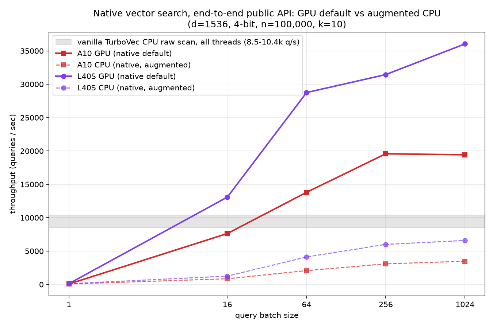

<h1 align="center">LodeDB</h1>
<p align="center">🔥 the <b>fastest</b> and <i>most compact</i> embedded vector database in the world 🌍</p>

[](LICENSE)
[](pyproject.toml)

*Built by [Egoist Machines, Inc.](https://egoistmachines.com) - efficient full-stack infrastructure
for reliable AI systems.*

LodeDB is great for local RAG; it's _extremely fast_, exact by default, in-process, and on-disk. We're the **best drop-in** durable memory backend for **LangChain, LlamaIndex, and mem0**: the most
compact on disk, the fastest per single query, GPU-accelerated for batched search, and durable in
about a millisecond per write. Point any of them at LodeDB instead of its default store. Over 17.5k
documents, per framework default:

| vs the framework's default store | LangChain `InMemoryVectorStore` | LlamaIndex `SimpleVectorStore` | mem0 Qdrant |
|---|---|---|---|
| On-disk footprint | **13.6× smaller** (15 vs 199 MB) | **9.9× smaller** (15 vs 145 MB) | **5.7× smaller** (12 vs 70 MB) |
| Single-query p50 (CPU) | **~600× faster** (0.45 vs 272 ms) | **~620× faster** (0.44 vs 272 ms) | **~46× faster** (0.59 vs 27 ms) |
| Batched retrieval, 64 (GPU) | **~2,880×** (11,049 vs ~4 qps) | **~3,050×** (11,297 vs ~4 qps) | **~139×** (5,084 vs 36 qps) |
| Durable add of one memory | **~26,000× faster** (0.26 ms vs 6.9 s) | **~57,000× faster** (0.26 ms vs 14.8 s) | **0.28** vs 0.44 ms (both sub-ms) |

Among embedded stores, LodeDB has the smallest footprint and the fastest single-query and batched
search, and its durable add leads the fastest lazy-append stores
(sqlite-vec, qdrant) too:

| **embedded stores** | **durable add p50** | **single-query p50** | **batch-64/query** | **memory footprint** |
| --- | ---: | ---: | ---: | ---: |
| **LodeDB** | **0.26 ms** | **0.45 ms** | **0.09 ms** | **15 MB** |
| sqlite-vec | 0.42 ms | 26.8 ms | 24.7 ms | 96 MB |
| qdrant | 0.48 ms | 13.9 ms | 14.2 ms | 81 MB |
| pgvector | 2.29 ms | 35.1 ms | 37.0 ms | 48 MB |
| lancedb | 3.36 ms | 10.6 ms | 10.3 ms | 35 MB |
| chroma | 5.92 ms | 3.35 ms | 3.26 ms | 144 MB |

All numbers are reported as the mean of 3 independent runs on a L40S server. [Full benchmark, all backends
(FAISS, Chroma, Qdrant, LanceDB, sqlite-vec, pgvector), and method.](benchmarks/memory_integrations)

> **Like what you see?** Point the coding assistant in your project at
> [egoistmachines.com/lodedb/install-agent](https://egoistmachines.com/lodedb/install-agent)
> and it will migrate your existing store onto the LodeDB backend.

Most embedded vector databases stop at the CPU. LodeDB runs the same on-disk index **on the
GPU** when you have one: batched search hits *24k queries/sec on an A10 and 53k qps on an L40S*,
with recall matching the CPU scan. It also persists changed rows incrementally, so a commit
stays **sub-millisecond even at 1M vectors**.

- **GPU-resident batch search**: a float32 copy of the index lives on the GPU, scored with a
  cuBLAS GEMM plus an on-device top-k (`[gpu]`, Linux/CUDA). [How it works](#gpu-resident-index).
- **O(changed) persistence**: commits only the rows that changed, 173× to 1,308× faster
  than a full rewrite. [How it works](#delta-persistence).
- **Compact storage**: the MIT [TurboVec](#turbovec) core packs vectors into 2/4-bit codes
  and scans them with SIMD CPU kernels; retained document text is stored zstd-compressed
  (on by default, set at create time with `compression=`).
- **In-process, on-disk** (`.tvim`/`.tvd`/`.jsd`): no daemon, no account, no API key.
- **Safe concurrency**: one writer and many lock-free readers per path; every commit is
  crash-atomic and rolls back to the last committed state on failure, never a torn store.
  [How it works](#concurrency--durability).
- **Private by default**: text, ids, and vectors stay local; telemetry is metrics-only
  (counts, bytes, latency), never raw payloads.
- **Local embeddings**: ONNX Runtime by default (lower per-query latency), with a PyTorch
  `sentence-transformers` fallback; runs on CPU, CUDA, or MPS. Pick with `embedding_runtime=`.
  On an NVIDIA GPU install `onnxruntime-gpu` (the default wheel is CPU-only); LodeDB warns if
  embedding silently falls back to the CPU. [Running on the GPU](docs/deployment-and-performance.md#running-embedding-on-the-gpu).
- **Multimodal**: index images and text in one shared CLIP space (`model="clip"`) for
  cross-modal search, or bring your own vectors from any model.
  [How it works](#multimodal--bring-your-own-vectors).
- **Batteries included**: a `lodedb` CLI, a loopback/private-network dev server, an
  [MCP server](#use-as-an-mcp-server), LangChain, LlamaIndex, and mem0 adapters
  (`VectorStore`s, plus a LlamaIndex `PropertyGraphStore`), a
  [cognee](https://github.com/topoteretes/cognee) vector-DB provider, and a one-line
  [PrivateGPT](https://github.com/zylon-ai/private-gpt) vector-store provider built on the
  LlamaIndex adapter.
- **Swift / iOS bindings**: a native Swift package for macOS and iOS over the same Rust
  core, with on-device vector, text, and hybrid search, durable storage, metadata filters,
  late-interaction (MaxSim), and an agent-memory facade. [Swift guide](swift/LodeDBCore/README.md),
  published as the [`swift-lodedb`](https://github.com/Egoist-Machines/swift-lodedb) SwiftPM package.
- **Migrate onto LodeDB**: `lodedb migrate` moves an existing LangChain, LlamaIndex, or mem0
  store, or a direct provider such as pgvector, onto a local LodeDB path along a
  plan-first, non-destructive inspect/plan/dry-run/run/validate path.
  [Migration guide](docs/integrations.md#migrating-onto-lodedb).

> 🏢 **Enterprise** The LodeDB core is Apache-2.0 and free to use. Enterprise licensing is
> available for commercial support, managed and at-scale serving, and on-prem / BYOC
> deployment. Contact [sales@egoistmachines.com](mailto:sales@egoistmachines.com).

## Install

```bash
pip install "lodedb[embeddings]"   # vector store + built-in text embedding (ONNX, no PyTorch)
```

Prebuilt wheels cover Linux, macOS (Apple Silicon and Intel), and Windows on Python 3.11+, and
bundle the TurboVec (Rust) core, so there's nothing to compile. Confirm the install with `lodedb
doctor`.

Bringing your own vectors or embedding model? The base install carries no embedding runtime. It's
a dependency-light vector store (`open_vector_store` / `add_vectors` / `search_by_vector`,
or pass your own `embedder=`):

```bash
pip install lodedb
```

Optional extras:

```bash
pip install "lodedb[embeddings,torch]"               # + PyTorch fallback, CLIP, Apple MPS
pip install "lodedb[gpu]"                            # GPU-resident scan (Linux/CUDA)
pip install "lodedb[image]"                          # image + text (CLIP) embedding (model="clip")
pip install "lodedb[mcp,langchain,llama-index,mem0]" # MCP server + LangChain/LlamaIndex/mem0 adapters
pip install "lodedb[cognee]"                         # register LodeDB as a cognee vector_db_provider
pip install "lodedb[onnx-export]"                    # export ONNX for a custom model (Optimum); presets need no export
pip install "lodedb[all]"                            # everything above (except gpu/onnx-export/cognee)
```

Using LodeDB as memory for a coding assistant? After installing the `mcp,embeddings` extras,
register its server in one step (details under [Use as an MCP server](#use-as-an-mcp-server)):

```bash
lodedb mcp install --client claude-code        # or: claude-desktop | cursor | lm-studio | codex | all
```

<details>
<summary><b>Windows: NVIDIA GPU embeddings</b></summary>

On Windows, PyPI serves the CPU-only PyTorch build by default, so installing the PyTorch tier
(`pip install "lodedb[torch]"`, and `uv`) leaves embeddings on the CPU even on a CUDA machine,
and no package metadata can override which torch wheel pip resolves. `lodedb doctor` detects this
and prints the fix; `lodedb doctor --fix` reinstalls the CUDA build for you:

```bash
lodedb doctor          # flags a CPU-only PyTorch on Windows and prints the command
lodedb doctor --fix    # reinstalls the CUDA build so embeddings use your NVIDIA GPU
```

Or reinstall manually, picking the index for your CUDA version (`cu121`, `cu124`, ...) from the
[PyTorch install guide](https://pytorch.org/get-started/locally/):

```bash
pip install torch --force-reinstall --no-deps --index-url https://download.pytorch.org/whl/cu121
uv pip install torch --reinstall --index-url https://download.pytorch.org/whl/cu121   # with uv
```

This is Windows-only: the default Linux PyPI wheel already bundles CUDA, and macOS uses CPU
or MPS.

</details>

<details>
<summary><b>Build from source</b> (contributors, or a platform without a wheel)</summary>

Needs a Rust toolchain and a CBLAS provider (Accelerate on macOS, `libopenblas-dev` on
Linux). [uv](https://docs.astral.sh/uv/) builds and bundles the core for you:

```bash
git clone https://github.com/Egoist-Machines/LodeDB && cd LodeDB
uv sync                                 # builds + bundles the TurboVec core via maturin
uv sync --extra embeddings --extra torch                               # + built-in text embedding (ONNX + PyTorch)
uv sync --extra mcp --extra langchain --extra llama-index --extra mem0  # + MCP server, adapters
uv sync --extra gpu                                                     # + GPU-resident scan (Linux/CUDA)
```

Run with `uv run` (e.g. `uv run lodedb doctor`).

</details>

## Quickstart

```python
from lodedb import LodeDB

with LodeDB(path="./data", model="minilm") as db:   # "minilm" (fast) | "bge" (quality) | "clip" (image+text)
    fox = db.add("the quick brown fox jumps", metadata={"topic": "animals"})
    db.add("a lazy dog sleeps all day", metadata={"topic": "animals"})

    for score, doc_id, meta in db.search("fox", k=5):
        print(score, doc_id, meta)

    for hits in db.search_many(["fox", "dog"], k=5):   # batched; the GPU can serve this
        print([(h.score, h.id, h.metadata) for h in hits])

    # filter by metadata: exact match, plus $gt/$gte/$lt/$lte/$in/$nin/$exists and $and/$or/$not
    db.search("fox", k=5, filter={"topic": "animals"})                      # bare scalar = exact
    db.search("fox", k=5, filter={"$or": [{"topic": "animals"}, {"year": {"$gte": 2020}}]})

    # hybrid search: vector recall plus exact lexical matches the embedding misses
    db.add("turbine tripped, fault code E1234 overnight", metadata={"topic": "ops"})
    for score, doc_id, meta in db.search("E1234", k=5, mode="hybrid"):  # exact code the vector misses
        print(score, doc_id, meta)

    print(db.get(fox))   # "the quick brown fox jumps"  (text retained by default)
# leaving the block persists a durable .tvim/.tvd/.jsd snapshot and releases the store
```

Reopen with `LodeDB(path="./data")`; no migration step. Original text is kept in a
`.tvtext` sidecar for `db.get`; pass `store_text=False` to keep none. Presets are `minilm`
(384-dim), `bge` (768-dim), and `clip` (512-dim, image+text), with weights pulled from Hugging
Face on first use. More in [`examples/`](examples/).

Need to read a store another process is writing to? Open it read-only. It takes no writer
lock, so it never blocks on (or is blocked by) the writer:

```python
reader = LodeDB.open_readonly("./data")   # or LodeDB(path="./data", read_only=True)
reader.search("fox", k=5)                 # reads a committed snapshot
reader.add("nope")                        # raises ReadOnlyError

reader.refresh()                          # overlay the current WAL tail (see appended records)
reader.applied_lsn()                      # highest LSN visible; >= an Appender's returned LSN == read-your-writes
```

The read-only handle is a stable snapshot of the last committed generation until
you call `refresh()`, which folds in whatever another process (or an `Appender`)
has written since, without taking a lock or checkpointing. For read-your-writes,
compare `applied_lsn()` to the LSN an append returned: the record is visible once
`applied_lsn() >= that_lsn`.

## Two ways to use LodeDB

Pick the mode by who owns the embeddings. The Quickstart above uses the recommended default; the
other is for when you already compute vectors yourself.

- **Text-in (recommended for RAG).** `LodeDB(path, model="minilm")` owns the embedder: you `add`
  and `search` **text**, and LodeDB embeds it, retains it, and can run hybrid BM25 + vector search.
  This is what most applications want.
- **Vector-in (bring your own vectors).** `LodeDB.open_vector_store(path, vector_dim=...)` has no
  embedder: you `add_vectors` and `search_by_vector` with vectors computed elsewhere (any model or
  hosted API). Use it when you own the embedding step or need a model LodeDB does not bundle.

| | Text-in (`model=`) | Vector-in (`open_vector_store`) |
| --- | --- | --- |
| Add | `add` / `add_many` (text) | `add_vectors` / `add_vectors_many` (vectors) |
| Search | `search` / `search_many` (text) | `search_by_vector` / `search_many_by_vector` |
| Hybrid / lexical BM25 | yes (`mode="hybrid"`) | no (no text to rank) |
| Raw-text retrieval (`get`) | yes (`store_text=True`, default) | no (metadata still returned) |
| Embedding runtime | bundled (ONNX / PyTorch) | none (you bring vectors) |
| Calling text verbs on it | works | raises `VectorOnlyIndexError` |

For per-tenant isolation, open one text-in `LodeDB` per tenant at its own path (optionally sharing a
single loaded model with `embedder=`). GPU setup, the performance knobs, the model-alias table, and
operational gotchas live in [Deployment and performance](docs/deployment-and-performance.md).

## Hybrid search

Hybrid retrieval is the default. Vector search alone misses exact tokens the embedding does not
capture: error codes (`E1234`), serial numbers (`ABC-123`), dates (`2024-01-15`). By default
LodeDB runs a lexical BM25 ranker alongside the vector scan and fuses the two ranked lists with
Reciprocal Rank Fusion, so a document whose body carries the code is recovered even when the
embedding ranks it nowhere near the top. The default resolves to hybrid whenever a text source is
available (the out-of-the-box configuration) and falls back to a plain vector scan otherwise, so
it never raises on a vector-only store.

```python
db.add("the turbine tripped and reported fault code E1234 overnight", metadata={"unit": "t3"})

db.search("E1234", k=5)                  # default: hybrid (BM25 + RRF) when text is retained
db.search("E1234", k=5, mode="vector")   # vector scan alone: may miss the exact code
db.search("E1234", k=5, mode="lexical")  # BM25 ranking alone, no vector scan
```

<details>
<summary><b>Prerequisites</b></summary>

`mode="hybrid"` and `mode="lexical"` build a BM25 index over your text, so they need a text
source enabled when you open the database. Both text sources are on by default, so the hybrid
default works out of the box; `mode="vector"` needs nothing and is the automatic fallback when no
text source is present.

| Mode | Enable | Source of the BM25 index |
| --- | --- | --- |
| `"hybrid"` (default), `"lexical"` | `store_text=True` (on by default) | rebuilt in memory from the retained raw text |
| `"hybrid"` (default), `"lexical"` | `index_text=True` (on by default, follows `store_text`) | a durable on-disk postings store, no raw text required |
| `"vector"` (fallback) | nothing | not used |

Both sources are on by default, so hybrid and lexical work out of the box: `store_text=True`
retains the raw text and `index_text` defaults to match it, persisting the lexical postings.
Either source alone is enough, and `index_text` decouples from `store_text` when set explicitly.
With neither source enabled (`store_text=False, index_text=False`), the default resolves to a
plain vector scan; an *explicit* `mode="hybrid"`/`"lexical"` then raises a clear, actionable
error rather than silently degrading.
</details>

<details>
<summary><b>How it works</b></summary>

A `filter` constrains both rankers, so `mode="hybrid"` with a filter returns the true top-k of
the matching subset. The vector half of a hybrid query runs on the same scan as `mode="vector"`,
including the GPU-resident batch scan that serves `search_many`; only the BM25 ranking and the
fusion run on the CPU, and the vector kernel and on-disk format are untouched. The serving BM25
index lives in memory and is maintained incrementally: a small mutation folds just the changed
chunks into the existing index, so a single `add` never forces a full re-tokenization.
</details>

<details>
<summary><b>Durable lexical index (`index_text=True`)</b></summary>

`index_text` defaults to match `store_text` (on by default), so each document's per-chunk terms
are captured at `add` time into a dedicated `.tvlex` sidecar (a base plus a `.lxd` delta journal,
committed O(changed) per write). Hybrid and lexical search then survive a reopen rebuilt straight
from the persisted terms, with no re-tokenization. Pass `index_text=False` to skip persistence:
with `store_text=True` the index is instead rebuilt in memory from the retained raw text on the
first hybrid query after opening. Set it explicitly to decouple the two, e.g. `index_text=True,
store_text=False` for a durable lexical index that retains no raw text at all. The `.tvlex`
sidecar holds payload-derived terms only and, like the raw-text sidecar, never reaches the
redacted artifacts or telemetry. The tokenizer lowercases and splits on punctuation but keeps
code-like tokens whole, so `ABC-123` and `2024-01-15` stay findable as single tokens. Reopen with
the same effective `index_text` value you wrote with.

```python
db = LodeDB(path="./data", index_text=True, store_text=False)  # durable lexical index, no raw text
db.add("the turbine tripped and reported fault code E1234 overnight")
db.close()

reopened = LodeDB(path="./data", index_text=True, store_text=False)
reopened.search("E1234", k=5, mode="hybrid")  # works after reopen, rebuilt from persisted terms
```
</details>

<details>
<summary><b>Approximate search (`ann="cluster"`)</b></summary>

LodeDB scans exactly by default: every query compares against every vector, so recall is 100%.
For large corpora where that full scan is the bottleneck, pass `ann="cluster"` at create time to
opt into IVF-style cluster pruning. The query scores cluster centroids, scans only the nearest
`nprobe` clusters, and the exact TurboVec scan re-scores those candidates. Returned scores are
therefore exact, but the result set is approximate: a true neighbor sitting in an unprobed
cluster can be missed, so recall drops below 100%. Exact scan stays the default and the
authority, and probing every cluster reproduces the exact top-k.

```python
db = LodeDB(path="./data", ann="cluster")                       # opt in; exact is the default
db = LodeDB(path="./data", ann="cluster", ann_clusters=256, ann_nprobe=16)  # optional tuning
db.add("the turbine tripped and reported fault code E1234 overnight")
db.search("turbine fault", k=5)                                 # nearest clusters, exact re-score
```

`ann_clusters` (partitions) defaults to about `sqrt(n)` and `ann_nprobe` (clusters probed per
query) to about `sqrt(clusters)`. ANN is a create-time choice persisted with the index and works
for text and bring-your-own-vector indexes alike; keep the exact default for small-to-mid corpora.
On reopen, `ann_nprobe` is a session-only override, so benchmark handles can change probe breadth
without rebuilding; the algorithm and partition count remain the persisted configuration.

For large corpora, these are useful starting ranges to measure, not recall or latency promises:

| Knob | Useful range | Trade-off |
| --- | --- | --- |
| `ann_nprobe` | 64 to 256 clusters | More probes raise recall and scan work; probing every cluster is exact. |
| `rescore_oversample` | 2 to 8 times `k` | More candidates improve the chance that fp32 re-ranking repairs compact-code errors, at more sidecar reads. |
</details>

<details>
<summary><b>Two-stage rescore (`rescore="original"`)</b></summary>

TurboVec's compact 4-bit scan is fast, but its quantized first-stage ranking can put close
neighbors in the wrong order. Enable rescore at creation to retain each input vector in a separate
original-precision sidecar, then re-score the first-stage candidate pool with fp32 dot products:

```python
db = LodeDB(
    path="./data",
    ann="cluster",
    ann_clusters=1024,
    rescore="original",
    rescore_dtype="float16",      # default; about 2 bytes per dimension per vector
    rescore_oversample=4,
)
```

`float16` sidecars add about 2 bytes per dimension per vector (`float32` adds 4; `int8` adds 1).
They let the final ordering rise above the practical 4-bit ranking ceiling while retaining the
compact index for candidate generation. Re-scored candidate scores are exact fp32 dots, but the
overall result can still be approximate when ANN or a too-small candidate pool excludes a true
neighbor. Rescore is a create-time capture choice: originals are not recoverable after a normal
store's first ingest, so enabling it later requires a rebuild. On a rescore-enabled reopen,
`rescore_oversample` is a session-only override; mode and dtype must match the persisted sidecar.
</details>

## Multimodal & bring-your-own vectors

The storage and scan are modality-agnostic: TurboVec stores any normalized float32
vector, so an image, audio, or video embedding is indexed and scanned exactly like a
text one. There are two ways to use that.

Bring your own vectors. Open a vector-only index at your dimension and pass the
embeddings you already computed with any model (CLIP, SigLIP, ImageBind, an audio or
video encoder, a hosted API). No embedding model is bundled on this path:

```python
db = LodeDB.open_vector_store("./media", vector_dim=512)
db.add_vectors(image_vector, id="img-001", metadata={"path": "photos/img-001.jpg"})
db.search_by_vector(query_vector, k=10)
```

Or use the built-in `clip` preset for image and text in one shared space, so a text
query retrieves images and an image query retrieves images and text. It runs on the
sentence-transformers stack plus Pillow for decoding, both pulled by `pip install 'lodedb[image]'`:

```python
db = LodeDB("./gallery", model="clip")            # downloads clip-ViT-B-32 on first use
db.add_image("photos/beach.jpg", metadata={"path": "photos/beach.jpg"})
db.search("a beach at sunset", k=5)               # text -> image, cross-modal
db.search_by_image("photos/beach.jpg", k=5)       # image -> image
```

The raw image is never stored; keep it on disk and put its path in `metadata`. Keep one
embedding model per index (scores are only comparable within one space); the model
identity is pinned and re-enforced on reopen. To hold several encoders side by side, use
`LodeCollection` named spaces, and pass `embedder=` to drive an index with your own
model. See [`docs/multimodal.md`](docs/multimodal.md).

## Late-interaction (multi-vector) retrieval

For visual-document RAG, ColPali / ColQwen style models encode a page as a *set* of
patch vectors and rank with MaxSim (sum over query tokens of the best patch match),
rather than pooling to one vector. `LodeLateInteractionIndex` runs this on the
bring-your-own-vectors path with no engine change: each document is one row holding
its whole patch matrix, and an unfiltered query is answered by an exact resident
scan (the corpus scored in one GEMM plus a segmented max) that returns the true
top-k in a few milliseconds on thousands of pages; filtered queries score the
matching subset exhaustively and over-budget corpora stream from disk (both exact).

```python
from lodedb import LodeLateInteractionIndex

idx = LodeLateInteractionIndex("./pages", dim=128)        # bring your own encoder
idx.add_document("report-p1", page_patches, metadata={"file": "report.pdf"})
hits = idx.search(query_tokens, k=5)                       # [(score, doc_id, metadata), ...]
```

The encoder stays bring-your-own (ColPali / ColQwen weights are multi-GB). Patch
matrices are stored at `storage="float32"` (default, fastest query and bit-exact),
`"float16"` (near-exact, half the size), or `"int8"` (~4x smaller); the choice
persists with the index. See [`docs/late-interaction.md`](docs/late-interaction.md).

## GPU-resident index

With the `[gpu]` extra on a CUDA host, LodeDB keeps a reconstructed float32 copy of the
compact index resident on the GPU and scores a batched `search_many` with a cuBLAS GEMM plus
an on-device top-k. It is opt-in and lazy: single queries, non-CUDA hosts, and GPU-memory
rejection fall back to the CPU scan, which stays the source of truth.

Both scans stream the corpus once per batch and amortize that read across the queries, so
per-query throughput climbs with batch size; the GPU pulls away as the batch grows and its
parallelism dominates. End-to-end through the public arrays API
(`search_many_by_vector_arrays`, scores and ids) on a 4-bit index (d=1536, 100K):

| query batch | A10 GPU | L40S GPU |
|---:|---:|---:|
| 16 | 8,413 | 12,469 |
| 64 | 19,030 | 33,040 |
| 256 | 23,669 | 49,927 |
| 1024 | **24,359** | **52,940** |

These are the arrays fast path; the default hits API (per-hit result objects) runs somewhat
lower, about 18.4k / 35.6k q/s at batch 1024. A single query stays on the CPU (the GPU batch
path engages at batch >= 4) and is one exact scan over the whole corpus, so its cost is bound
by memory bandwidth rather than the API; batching amortizes that corpus read, which is what
the throughput above exploits.

The curves below are the GPU and CPU scans through that same default hits API, so the gap is
like-for-like:



A one-line reproduction is in [benchmarks/vector_search_native](benchmarks/vector_search_native/).

Recall matches the CPU scan: the GPU scores the same 4-bit reconstruction, and LodeDB's
parity tests hold its document recall within 0.002 of the CPU scan across batch sizes, so
moving a query to the GPU changes its latency, not its results.

Other in-process vector databases stay CPU-bound. Alibaba's
[zvec](https://github.com/alibaba/zvec) reports about 8.4k q/s (VectorDBBench, 16-vCPU CPU,
Cohere 768-dim); read it as the CPU-class baseline that the GPU-resident path clears.

**Scope.** GPU search is Linux/CUDA-only and opt-in (`[gpu]`). macOS scans on the CPU by
default; a first-class opt-in MPS exact scan exists (`LODEDB_MPS_DIRECT_TURBOVEC`) but NEON
stays the default. On the measured M1 it was slower than NEON at every batch size; newer Apple
GPUs should be re-measured before any default change. See [docs/benchmarks.md](docs/benchmarks.md) and
[docs/architecture.md](docs/architecture.md).

## Delta persistence

Most embedded indexes rewrite the whole file on every change (O(N)). LodeDB writes only the
rows that changed (O(changed)), so a 1,000-row commit stays sub-millisecond at any size:

| corpus | full rewrite | delta export | speedup |
|---:|---:|---:|---:|
| 100K | 42.4 ms | 0.25 ms | 173× |
| 500K | 190.4 ms | 0.24 ms | 782× |
| 1M | 404.9 ms | 0.31 ms | **1,308×** |

The GPU path makes reads fast; the delta makes writes cheap. The on-disk format stays a
plain snapshot that replays on reopen.

The opt-in raw-text store (`store_text=True`) is journaled the same way: an incremental commit
appends a small `.txd` text delta instead of rewriting the whole `document_id -> text` map, so
enabling text retrieval keeps commits O(changed) too. Isolated, the per-commit text write drops
from a full-map rewrite (~57 ms at 20K docs, ~244 ms at 80K) to a flat **~0.7 ms** regardless of
corpus size.

And the rest of an incremental `add()` is O(changed) too: a single-doc update no longer rebuilds
the whole index layout or rewrites the full text map on the commit path, so write latency stays
flat as the corpus grows instead of climbing with it.

## Benchmarks

All artifacts are metrics-only (counts, bytes, latency), never payloads. Full methodology
and the complete figure set are in [docs/benchmarks.md](docs/benchmarks.md); each
[benchmarks/](benchmarks/) folder has a README and a one-line reproduction command.

Local is the common case. On an Apple M1 (MiniLM, 20K docs) the CPU scan is ~0.25 ms p50,
and end-to-end single-query latency is 5.7 ms p50.

## CLI

```bash
lodedb doctor      # capability report: embedding / GPU / TurboVec backend
lodedb index ...   # build / add to an on-disk index
lodedb query ...   # search
lodedb serve       # dev server (127.0.0.1 by default; private LAN only, no auth)
lodedb mcp         # stdio MCP server for agent memory
lodedb benchmark   # local, metrics-only benchmark
```

Use `lodedb serve` as a local OpenAI-compatible embeddings provider; see [LodeDB as a local
embeddings provider](docs/integrations.md#lodedb-as-a-local-embeddings-provider).

## Use as an MCP server

LodeDB ships a [Model Context Protocol](https://modelcontextprotocol.io) server, so an agent
can use a local on-disk database as long-term memory or a RAG store. It runs over stdio, adds
no storage logic of its own, and your data stays on the machine. The server embeds text to add
and search, so install the MCP and embedding extras together, then point your host at `lodedb
mcp`:

```bash
pip install "lodedb[mcp,embeddings]"

# for coding assistant:
lodedb mcp install --client claude-code  # or: claude-desktop | cursor | lm-studio | codex | all
```

It exposes `lodedb_add`, `lodedb_search`, `lodedb_remove`, and `lodedb_stats`, plus
`lodedb_get` when text is available. `lodedb_search` returns each hit's stored text alongside
the score, id, and metadata, so a model can rank and answer in a single call rather than
chaining a follow-up lookup. It runs [hybrid search](#hybrid-search) (BM25 lexical + vector,
fused with RRF) by default when text is retained, so exact tokens like error codes and serials
surface next to semantic matches; with no text retained it falls back to a vector scan. Start
the server with `--exclude-text` to return metrics only (this also withdraws `lodedb_get`), or
`--no-store-text` to keep no text on disk at all. `lodedb_stats` is always metrics-only and raw
query text never leaves the process.

### One command install

`lodedb mcp install` writes the correct entry to a client's config for you, so you do not have to
find the file or hand-write the JSON/TOML:

```bash
lodedb mcp install --client claude-code        # or: claude-desktop | cursor | lm-studio | codex | all
lodedb mcp install --client cursor --path ./data --model bge
```

It resolves the launch command for your environment, so `command` and `args` are correct even when
`lodedb` is not on `PATH` (it falls back to the `uv run --project ...` form, then an absolute path to
the entry point), and it resolves `--path` to an absolute path so the server opens the right
directory wherever the client starts it. The edit is idempotent (an existing `lodedb` entry is
updated, never duplicated) and never touches other servers in the file. It passes through the same
options as `lodedb mcp` (`--path`, `--model`, `--device`, `--exclude-text`, `--no-store-text`);
`--dry-run` prints the entry and target file without writing, and `lodedb mcp uninstall --client
<client>` removes it again. Override the config location with `--config <path>` (Claude Desktop and
LM Studio paths differ per OS), and use `--project <dir>` to write Cursor's project-level
`.cursor/mcp.json`. For Claude Code it runs `claude mcp add`; for the others it edits the config file
directly.

<details>
<summary><b>Register by hand</b> (Claude Code, Claude Desktop, Cursor, LM Studio, Codex)</summary>

The `lodedb` command must be on the host's `PATH`; if you installed into a virtual environment
(including a `uv` project) where it isn't, use the `uv run` form at the bottom.

**Claude Code, Claude Desktop, Cursor, LM Studio**: add the stdio entry to the host's MCP
config (`claude_desktop_config.json`, `.cursor/mcp.json`, or LM Studio's `mcp.json`), or run
`claude mcp add lodedb -- lodedb mcp --path ./data`:

```json
{ "mcpServers": { "lodedb": { "command": "lodedb", "args": ["mcp", "--path", "./data"] } } }
```

**Codex**: add to `~/.codex/config.toml`:

```toml
[mcp_servers.lodedb]
command = "lodedb"
args = ["mcp", "--path", "./data"]
```

**From a virtual environment (uv)**, when `lodedb` is not on `PATH`:

```json
{ "mcpServers": { "lodedb": { "command": "uv",
  "args": ["run", "--project", "/path/to/LodeDB", "lodedb", "mcp", "--path", "/path/to/data"] } } }
```

See [`examples/mcp_config.json`](examples/mcp_config.json) for a copy-paste starting point.

</details>

## Concurrency & durability

- **Single writer, many readers, per path.** One handle holds the path open for *writing* at
  a time (an exclusive OS advisory lock); a second writer waits for it to close, then fails
  fast (`ConcurrentWriterError`) after `LODEDB_PERSIST_LOCK_TIMEOUT` (default 30s).
  **Read-only** handles (`LodeDB.open_readonly(path)` or `read_only=True`; used by
  `lodedb query`/`get`) take *no* lock, so they read one consistent committed snapshot **while**
  a writer is open. They just don't auto-see the writer's in-flight changes (no live
  cross-process refresh). Within one process the engine serializes operations under an
  in-process lock, so the threaded `lodedb serve` safely shares one handle.
- **Crash-atomic commits.** A commit spans several files, but it is sealed by atomically
  swapping one `<key>.commit.json` root pointer over generation-addressed artifacts, so a
  crash mid-commit rolls back to the last committed generation on reopen (never a torn,
  half-applied store) and readers always load one consistent generation.
- **Durability is `fast` by default.** Commits are *atomic* but not fsync'd. Pass
  `durability="fsync"` (or `--durability fsync` / `LODEDB_DURABILITY=fsync`) to fsync each
  file and its directory on commit for power-loss durability, at some commit-throughput cost.
- **WAL commit by default for low-latency durable writes.** Each `add`/`remove` appends one
  framed record to a `<key>.wal` log and a full generation is checkpointed periodically, so a
  durable single add costs roughly an order of magnitude less than publishing a whole generation
  per write, into the sqlite-vec/qdrant range (see the comparison up top). The WAL is replayed
  crash-atomically on reopen (a half-written trailing record is discarded), every writable open
  folds it into a clean committed generation, and `close()`/`persist()` checkpoint it. WAL is
  single-writer: a concurrent `open_readonly` reader still loads a consistent committed
  generation, but the last *checkpointed* one, not the writer's in-flight WAL. Pass
  `commit_mode="generation"` (or `LODEDB_COMMIT_MODE=generation`) for the classic path that
  publishes a crash-atomic, MVCC-readable generation on every write; pick it when many
  out-of-process readers must see each write the instant it commits. Note `<key>.wal` is
  **payload-bearing before a checkpoint** (raw text under `store_text=True`, otherwise embedding
  deltas plus, with `index_text=True`, lexical tokens), so treat it as sensitively as the data it
  indexes; `persist()`/`close()` checkpoint and truncate it, and `generation` mode keeps no WAL.
  See the [payload boundary](docs/architecture.md#persistence--payload-boundary) docs.
- **Concurrent multi-writer append (WAL mode).** Beyond the single exclusive writer, many
  processes can *append* to one path at once through a shared-lock appender. Each takes a shared
  lock (the exclusive writer's lock still excludes them), logs self-contained vector-in records to
  `<key>.wal` ordered by a durable, process-shared sequence allocator, and the next *writable* open
  folds them into a clean generation. Appends are durable once acknowledged under
  `durability="fsync"` (the default `fast` is atomic but not fsynced, like the writer's own adds)
  and become queryable after the next writable open folds them in, or immediately in a read-only
  handle that calls `refresh()` to overlay the WAL tail (whose `applied_lsn()` then gives
  read-your-writes against an append's returned LSN). On Windows the shared lock degrades to an
  exclusive hold, so appenders serialize there rather than coexisting. A record is a precomputed
  vector plus metadata (with an optional caption, e.g. for an image, retained only when the appender
  opts into `store_text` -- off by default, so no raw text reaches the WAL); with an embedder
  configured, the appender also ingests full text (chunked by the core, embedded in the binding
  layer, then logged as a post-embedding record) so text writes are multi-producer too, without a
  captured base generation. It requires WAL commit mode. Exposed as the native `CoreAppender`, over
  the C ABI, in Python (`lodedb.Appender`: `append`/`append_many` for vectors,
  `append_text`/`append_text_many` for text), and in Swift (`LodeAppender`).
- **Running checkpointer (WAL mode).** So appended records become durable without an
  application re-opening a writer, a *running checkpointer* folds the WAL into fresh
  generations continuously. It holds a crash-reclaimable lease (a sentinel distinct from
  the writer lock, so it elects one checkpointer at a time) and takes the exclusive writer
  lock only for the brief window of each fold, so appenders keep logging between folds.
  Drive its `checkpoint()` on a loop or timer; each fold advances the committed generation,
  so a read-only handle's `refresh()` (or a fresh open) sees the appended records shortly
  after they are logged, with no writable open in the loop. A dead lease-holder's lease is
  reclaimable, so a fresh checkpointer takes over after a crash. Exposed as the native
  `CoreCheckpointer`, over the C ABI, in Python (`lodedb.Checkpointer`), and in Swift
  (`LodeCheckpointer`).
- **Local filesystems only.** The OS advisory lock is unreliable on NFS/SMB.

## Swift / iOS

LodeDB has a native Swift binding for macOS and iOS over the same Rust core (no Python
runtime, no network, on device). It exposes durable open/persist, vector/text/hybrid
search, the full metadata-filter grammar, batched search, late-interaction (MaxSim),
a concurrent WAL appender (`LodeAppender`) for multi-process ingest,
on-device embedders (Apple `NLEmbedding` out of the box, or an ONNX parity path), and a
`LodeMemory` save/recall/forget facade for agent memory. The `.tvim` format is
byte-compatible, so an index built here loads on a phone. See
[swift/LodeDBCore/README.md](swift/LodeDBCore/README.md) and the agent contract in
[docs/swift-agent-contract.md](docs/swift-agent-contract.md).

## Limitations

- **Exact scan by default; opt-in ANN.** Exact scan is the default and the authority (full
  recall). An opt-in IVF-style cluster-prune index (`ann="cluster"`) trades a little recall for
  speed on large corpora by scanning only the nearest clusters and exactly re-scoring the
  candidates. Built for small-to-mid corpora, not billion-scale.
- **GPU-resident scan is Linux/CUDA-only and opt-in** (`[gpu]`). macOS has a first-class,
  opt-in Metal (MPS) exact scan (`LODEDB_MPS_DIRECT_TURBOVEC=auto`); NEON is the default and was
  faster on the measured M1, so the MPS scan stays off by default until newer Apple GPUs are
  re-measured.
- **Single queries run on the CPU**; the GPU serves batched `search_many`.
- **Hybrid search needs a lexical source and serves from memory.** `mode="hybrid"`/`"lexical"`
  need either `store_text=True` (the index built from raw text) or `index_text=True` (a durable
  `.tvlex` postings store that survives reopens without raw text). The serving index is held in
  memory and maintained incrementally across mutations.
- **Single exclusive writer per path.** One full writer at a time (many concurrent readers), with
  no live cross-process refresh, on local filesystems only. Concurrent *append* is the exception:
  in WAL mode many processes can log vector-in records at once via a shared-lock appender, folded
  in by the next writer. See [Concurrency & durability](#concurrency--durability).
- **Model weights download from Hugging Face** on first use, then cache locally.

## TurboVec

The compact core is the upstream **MIT** [TurboVec](https://github.com/RyanCodrai/turbovec)
project (© Ryan Codrai), vendored under [`third_party/turbovec/`](third_party/turbovec/)
with its license preserved. LodeDB's lifecycle patches (encoded-row export/import,
`upsert_with_ids`, calibration) are Apache-2.0. See [`NOTICE`](NOTICE).

## License

Apache-2.0 ([`LICENSE`](LICENSE)). The bundled TurboVec core is MIT ([`NOTICE`](NOTICE),
[`third_party/turbovec/LICENSE`](third_party/turbovec/LICENSE)). "LodeDB" and
"[Egoist Machines](https://egoistmachines.com)" are trademarks; Apache-2.0 grants no
trademark rights (§6).

Enterprise licensing and commercial support are available from
[Egoist Machines, Inc.](https://egoistmachines.com): contact
[sales@egoistmachines.com](mailto:sales@egoistmachines.com).

## Contributing & security

PRs welcome; see [`CONTRIBUTING.md`](CONTRIBUTING.md). Report security issues **privately**
per [`SECURITY.md`](SECURITY.md), not in public issues. Other bugs and requests go to the
[issue tracker](https://github.com/Egoist-Machines/LodeDB/issues).
