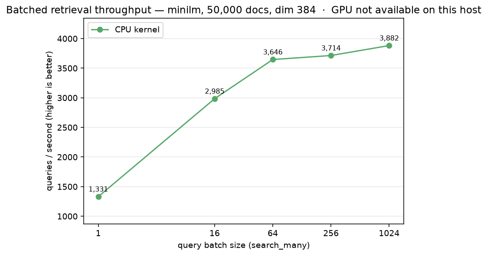

# Batched-retrieval throughput: `search_many` queries/sec

A metrics-only benchmark of the **public SDK path** `LodeDB.search_many(queries, k=...)`:
how many queries/sec it serves as the query batch grows. `search_many` is the batched entry
point that lets CUDA hosts serve a batch from the GPU-resident exact scan; single-query
`search` never takes that path. This is the only place the GPU-batch story shows up through
the supported API, and even on CPU, batching amortizes per-call overhead into real
throughput gains.

It runs **anywhere**: on a non-CUDA host it reports the CPU-kernel curve; with a CUDA GPU
and the `[gpu]` extra it adds the GPU-resident line, so the batch crossover is visible end
to end. No document or query text is ever logged, only counts, batch sizes, timings,
throughput, and backend labels.

This complements [`../direct_gpu_sweep/`](../direct_gpu_sweep) (the launch proof, which
drives the *engine* `query_batch` path on CUDA and checks recall parity / fallback /
fail-closed): here we measure the *public* `search_many` SDK method that applications call,
and we report throughput (q/s), locally reproducible.

## Run

```bash
# from the repo root, with the venv synced (uv sync --extra dev)
uv run python benchmarks/batched_retrieval/run.py --docs 50000 --queries 1024
uv run python benchmarks/batched_retrieval/diagrams.py     # renders docs/*.png + *.svg
```

On a CUDA host, install the GPU extra first (`uv sync --extra dev --extra gpu`) and the run
adds a GPU-resident line automatically. `diagrams.py` needs `matplotlib`, a dev-only tool,
not a LodeDB runtime dependency (`uv pip install matplotlib`).

## What it measures

- **Throughput** (`queries_per_second`) per batch size: `repeats` timed `search_many` calls
  on a batch of exactly `batch_size` queries; `q/s = batch_size × repeats / elapsed`.
- **Per-query latency** (`per_query_ms`) and per-call p50 (`per_call_ms_p50`).
- On CUDA, each GPU row carries `speedup_vs_cpu` and the `gpu_stage_one_status` audit label so
  you can confirm the GPU path actually engaged (vs. silent CPU fallback).

**Embedding is excluded by design.** Queries are embedded by a trivial local hash backend, so
the number isolates **retrieval**, the stage batching and the GPU accelerate. (End-to-end
`search_many` also pays query-embedding cost, which is independent of the store.)

## Results

Single-run, Apple M1 (CPU kernel only; no CUDA on this host), `minilm` (dim 384), 50,000
docs / chunks, `k=10`, 5 repeats:

| batch | queries/sec | per-query ms |
|---:|---:|---:|
| 1 | 1,331 | 0.751 |
| 16 | 2,985 | 0.335 |
| 64 | 3,646 | 0.274 |
| 256 | 3,714 | 0.269 |
| 1024 | 3,882 | 0.258 |

Batching alone is ~**2.9×** over single-query serving on CPU here, and that is *before* the
GPU-resident path, which (per the [GPU benchmarks](../gpu_vanilla_vs_augmented)) pulls ahead
of the CPU ceiling at batch ≥ 2 and scales with GPU class. Re-run on your own hardware for
variance.



## Note on integrations

The LangChain and LlamaIndex adapters call single-query `search` (their retriever contracts
are one-query-at-a-time), so they do **not** exercise `search_many` and leave this throughput
on the table. Batched retrieval is not part of those framework contracts, so this is a
standalone benchmark rather than an adapter change, but it quantifies the headroom available
to any offline / batch / multi-query workload that adopts `search_many` directly.
