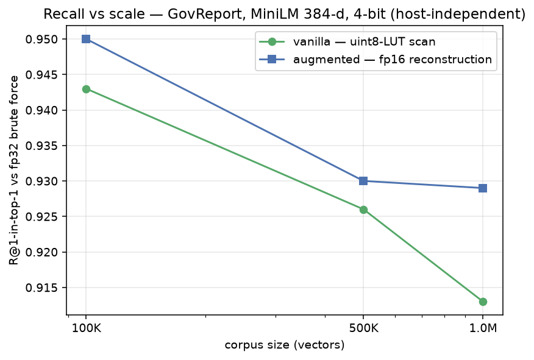
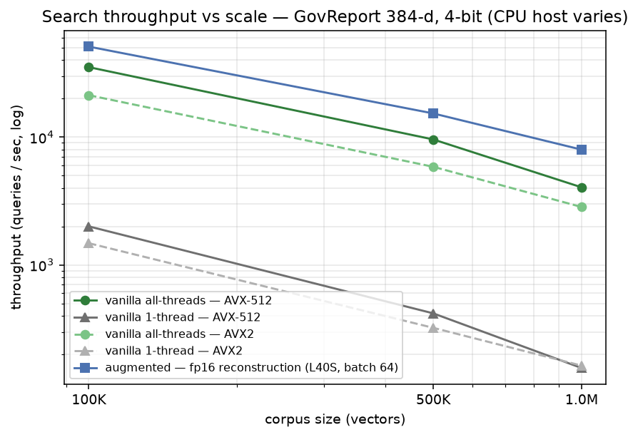
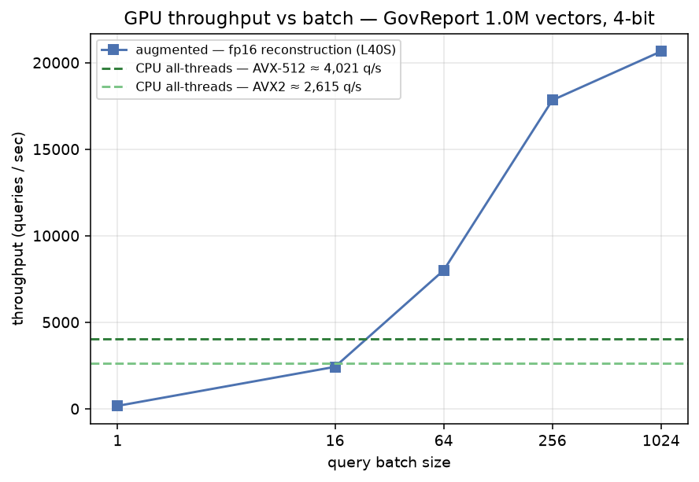

# GovReport at scale: vanilla vs. augmented TurboVec, 100K → 1M

Scale + correctness evidence for the TurboVec scan on **real GovReport embeddings**
(MiniLM, 384-d, cosine) across a 100K → 1M corpus-size sweep: does the scan stay correct at
1M vectors, and what is the CPU scan's practical throughput ceiling?

Both paths scan the **same 4-bit index**; the difference is the *scoring* step, not the bit
width:

- **vanilla**: TurboVec's native CPU SIMD scan (`index.search`), the default. It sums a
  **uint8 lookup table** (ADC-style) over the 4-bit codes; measured single-thread and
  all-threads (the CPU ceiling).
- **augmented**: the GPU-resident **fp16-reconstruction** scan
  (`lodedb.engine.gpu_turbovec.GpuDirectTurboVecSession`, the opt-in `[gpu]` path): each 4-bit
  code is reconstructed to fp16 and scored with a full GEMM dot product. It is "exact" only
  as *exact arithmetic over the 4-bit reconstruction* (no uint8-LUT rounding), not exact vs
  the original fp32.

Recall is R@1-within-top-k vs **exact fp32 brute-force** ground truth on the same embeddings
(that ground truth is the genuine fp32 exact). This sweep is GPU-only because the augmented
path needs CUDA and 1M-vector brute force is not laptop-scale.

## Run

Needs `modal` and `matplotlib` (dev tools, not LodeDB runtime deps). This benchmark reuses
the measurement core (`turbovec_vva_bench` / `turbovec_vva_runner`) from the sibling
[`../gpu_vanilla_vs_augmented`](../gpu_vanilla_vs_augmented) benchmark; the Modal image mounts
both dirs.

```bash
# validate the pipeline cheaply first (~40K chunks):
modal run benchmarks/govreport_scale/modal_bench.py::smoke
# full 100K/500K/1M run on an L40S:
modal run benchmarks/govreport_scale/modal_bench.py::main
# render charts from the results JSON:
python benchmarks/govreport_scale/diagrams.py
```

## Results: Modal L40S (`measured`)

**Corpus** (`recorded`): GovReport (`ccdv/govreport-summarization`) embedded with MiniLM
(`all-MiniLM-L6-v2`, 384-d), chunked at 480 chars to reach a full **1,000,000** vectors; 1,000
query summaries; k=64, median of 3 passes. GPU: **L40S**. The CPU scan's speed depends on the
host CPU kernel (Modal assigns it), so the speed charts overlay **both hosts measured**: an
**AVX2** host (this repo's run, `results.json`) and an **AVX-512** host (`results_avx512.json`).
Recall is host-independent. Embedding 1M chunks took ~276s.

### Recall: preserved at 1M, and the reconstruction scan widens its lead

R@1-in-top-k vs fp32 brute force:

| corpus | vanilla R@1 | augmented R@1 | R@8 (both) |
|---:|---:|---:|---:|
| 100K | 0.943 | 0.950 | 1.000 |
| 500K | 0.926 | 0.930 | 1.000 |
| 1M | 0.913 | **0.929** | 1.000 |

Both scans recover the true nearest neighbour within the top-8 at every scale (R@8 = 1.000).
At top-1 the vanilla uint8-LUT scan loses recall as the corpus grows (0.943 → 0.913); the
augmented fp16-reconstruction scan holds (0.950 → 0.929), so its edge **widens with scale**
(+0.007 at 100K → +0.016 at 1M). The exact GEMM avoids the uint8-LUT rounding error the LUT
scan accumulates as more near-neighbours crowd in. (Both carry the same irreducible 4-bit
code-quantization loss, which is why R@8 = 1.0 for both. Recall is CPU-arch-independent, so
these numbers are stable across hosts.)



### Speed: the CPU scan's ceiling (per host), and where the GPU pulls ahead

CPU all-threads throughput (the ceiling) for each host, vs the host-independent GPU scan
(queries/sec, batch 64 for the GPU):

| corpus | CPU all-threads — AVX2 | CPU all-threads — AVX-512 | augmented GPU (L40S)¹ |
|---:|---:|---:|---:|
| 100K | 21,236 | 35,175 | 50,894 |
| 500K | 5,855 | 9,578 | 15,296 |
| 1M | 2,839 | 4,047 | 7,972 |

¹ Host-independent (it's the L40S either way); the AVX-512 run measured the GPU within ~6%
(53,800 / 15,351 / 7,990 q/s). Single-thread is ~150–2,000 q/s, similar across hosts.

The CPU scan is O(N) (throughput ~1/N), and its ceiling depends on the host CPU kernel; at
1M it is **~4,050 q/s on AVX-512 vs ~2,840 on AVX2** (all-threads). The augmented GPU reconstruction
scan (batch 64) is **2.0× the AVX-512 ceiling / 2.8× the AVX2 ceiling** at 1M, and the multiple
grows with corpus size; the GPU's edge is naturally larger over a weaker CPU.



### Batch sweep at 1M: the GPU win is batched

Augmented GPU throughput vs batch (L40S), against each host's CPU all-threads ceiling:

| batch | augmented (q/s) | vs. AVX-512 (~4,021 q/s) | vs. AVX2 (~2,615 q/s) |
|---:|---:|---:|---:|
| 1 | 168 | 0.04× | 0.1× |
| 16 | 2,423 | 0.6× | 0.9× |
| 64 | 7,999 | 2.0× | 3.1× |
| 256 | 17,830 | 4.4× | 6.8× |
| 1024 | 20,646 | **5.1×** | **7.9×** |

Crossover is ≈ batch 20–60 (a touch higher against the faster AVX-512 CPU); below it the CPU
scan wins, so single queries route to the CPU.



## Reading

- **Correctness holds at 1M.** Both scans find the true nearest neighbour within top-8 at
  every scale; the reconstruction scan is at least as good at top-1 and its lead widens with
  corpus size.
- **The CPU scan ceiling is real and known.** At 1M, ~4,050 q/s all-threads on AVX-512 and
  ~2,840 on AVX2 (single-thread ~150–2,000). Beyond it, the batched GPU reconstruction scan is
  the path: ≈2–3× the ceiling at batch 64, ≈5–8× at batch 1024 (the lower multiple is against
  the faster AVX-512 host).
- Caveats: **single run per host.** The CPU ceiling depends on the host CPU kernel, so the
  speed numbers carry host variance; both an AVX2 and an AVX-512 host are measured here, and
  the **ratios are the portable signal** (recall is host-independent and matches across hosts).
  Chunks are 480 chars, chosen only to reach a full 1M vectors; chunk size sets the vector
  count, not scan correctness. This is **not** a concurrency/thread-safety test; that's a
  separate follow-up.

Files: the measurement core is `turbovec_govreport_scale.py` (GovReport loader + embedding +
orchestration); it reuses `turbovec_vva_bench` / `turbovec_vva_runner` from the sibling
`gpu_vanilla_vs_augmented` benchmark. Also here: `modal_bench.py` (smoke/full entrypoints),
`diagrams.py` (results → charts), `results/` (JSON), `docs/` (charts).
