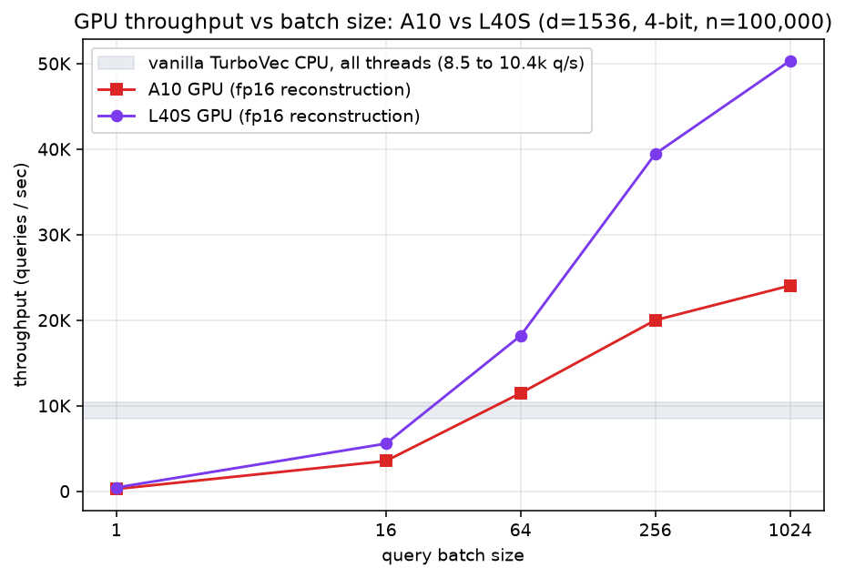
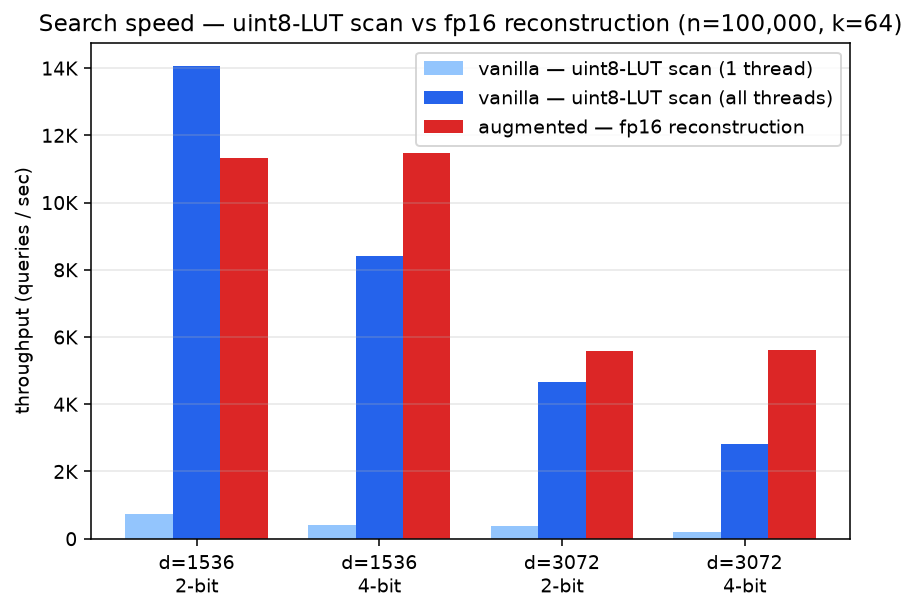
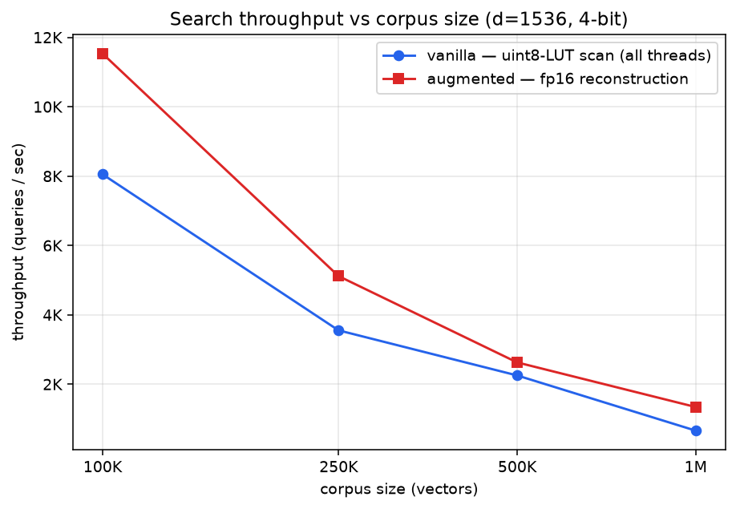
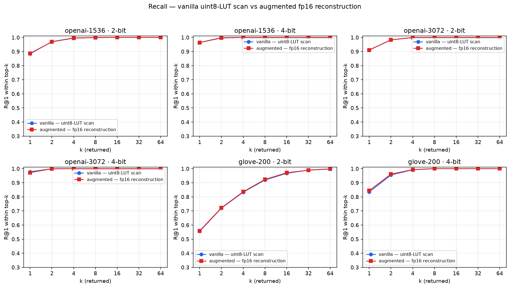
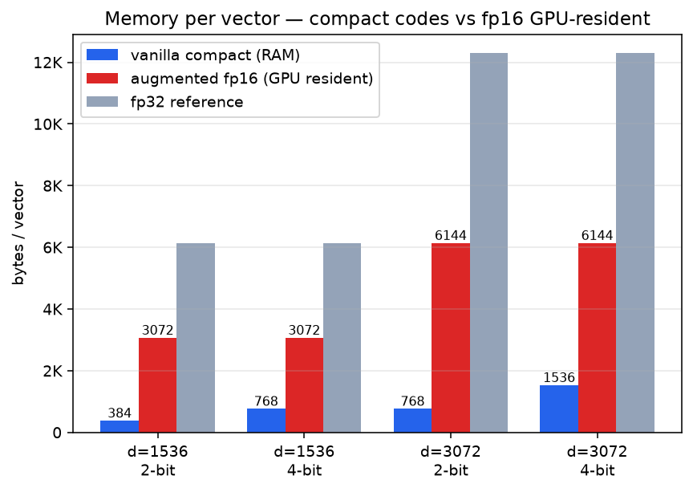
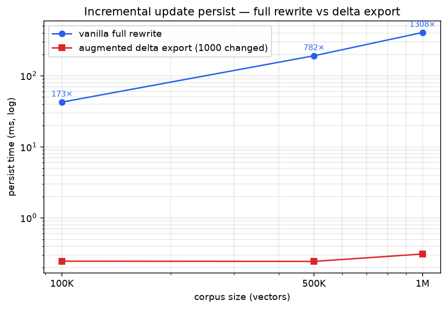

# Vanilla TurboVec uint8-LUT scan vs. the augmented GPU fp16-reconstruction scan

Benchmarks comparing the **vanilla TurboVec uint8-LUT scan** (the upstream
[RyanCodrai/turbovec](https://github.com/RyanCodrai/turbovec) CPU SIMD scan) against
LodeDB's **augmented GPU-resident fp16-reconstruction scan**
(`lodedb.engine.gpu_turbovec`), built on the CPU + GPU patches in
`third_party/turbovec/LOCAL_PATCHES.md`. It reproduces the kind of comparison the
upstream repo plots — recall, search speed, compression — but swaps the FAISS baseline
for the augmented GPU path. **No FAISS.**

Both series run against the **same** vendored 4-bit TurboVec index — the difference is
the *scoring step*. Both scan the same 4-bit index; the CPU sums a uint8 LUT (ADC), the
GPU does a full fp16 GEMM dot product. So "exact" here means exact over the 4-bit
reconstruction, not fp32:

- **vanilla** — `index.search(queries, k)`, the native NEON/AVX SIMD scan that sums a
  **uint8 lookup table (ADC-style)** over the compact 2/4-bit codes. The local patches
  *add* APIs (reconstruction, upsert, encoded-row export); they do not change this kernel,
  so it is the faithful "vanilla" baseline.
- **augmented** — the GPU path that reconstructs each 4-bit code to **fp16** and scores
  with a GEMM dot product (`lodedb.engine.gpu_turbovec.GpuDirectTurboVecSession`): every
  row is reconstructed once to fp16 on the GPU, and query batches are scored with a
  rotated-query GEMM + streaming device top-k. Because it scores the reconstructed vectors
  with full fp16 arithmetic rather than the uint8 LUT, it avoids the uint8-LUT rounding
  error the LUT scan accumulates (recall ≥ vanilla) — at the cost of fp16-resident GPU
  memory. It is "exact" only as exact arithmetic over the 4-bit reconstruction, not exact
  vs fp32; both scans carry the same irreducible 4-bit code-quantization loss.

The honest trade-off this surfaces: the augmented GPU path is **faster at high batch and
higher-recall**, but uses **more memory** (fp16 resident vs compact codes). The
augmented **CPU** patch (encoded-row delta export / `upsert_with_ids`) is a separate win
on **incremental persistence**, not scan speed.

## Axes

| Axis | Vanilla | Augmented | Diagram |
|---|---|---|---|
| **Search speed** | uint8-LUT CPU SIMD scan (1 thread + all threads) | fp16-reconstruction GPU scan | `docs/speed_parity.svg`, `docs/speed_scaling.svg`, `docs/speed_batch.svg` |
| **Recall** | uint8-LUT scan, R@1-within-top-k | fp16-reconstruction scan | `docs/recall.svg` |
| **Memory** | compact 2/4-bit codes (RAM) | fp16 resident (GPU) | `docs/memory.svg` |
| **Update/persist** | full `.tvim` rewrite (O(N)) | encoded delta export (O(changed)) | `docs/update.svg` |

## Methodology

- **Parity** with the upstream benchmark: 100K vectors, 1,000 queries, k=64, median of N
  passes. Recall uses real **OpenAI DBpedia** embeddings (d=1536, d=3072) streamed from
  Hugging Face (`Qdrant/dbpedia-entities-openai3-...`), 100K corpus + 1K held-out
  queries; ground truth is exact fp32 inner-product top-k.
- **Scaling**: a synthetic corpus-size sweep (100K → 1M, d=1536, 4-bit) for the speed
  axis, where the GPU path's throughput scaling shows. Synthetic vectors are unit-norm
  Gaussian — the data-oblivious regime TurboVec's random-rotation quantization targets.
- **Single- vs multi-threaded** CPU speed is measured in fresh subprocesses with
  `RAYON_NUM_THREADS` pinned (rayon reads it once per process).
- All metrics are counts / bytes / latency only — no documents, queries, or embeddings
  are logged or persisted.

## Reproduce

The augmented series needs CUDA (CuPy + the patched TurboVec reconstruction APIs).

### On a CUDA host directly (no Modal)

Build the patched TurboVec wheel and install LodeDB with the optional GPU extra, then run
the benchmark core directly. From the repo root:

```bash
# 1. Build the patched vendored TurboVec wheel (rustup + maturin) and install LodeDB
#    with the CUDA extra (pulls cupy-cuda12x). `uv sync` builds turbovec from source
#    via the path source in pyproject.toml.
uv sync --extra gpu          # or: pip install -e '.[gpu]'

# 2. Run the full matrix (writes results/results_a10.json). The runner inserts its own
#    directory onto sys.path, so `import turbovec_vva_bench` resolves; LodeDB must be
#    importable (step 1).
python benchmarks/gpu_vanilla_vs_augmented/turbovec_vva_runner.py \
    --out benchmarks/gpu_vanilla_vs_augmented/results/results_a10.json

# 3. Render diagrams from the results (matplotlib):
python benchmarks/gpu_vanilla_vs_augmented/diagrams.py \
    --results benchmarks/gpu_vanilla_vs_augmented/results/results_a10.json \
    --out benchmarks/gpu_vanilla_vs_augmented/docs
```

`turbovec_vva_runner.py` runs synthetic recall by default. The committed numbers use real
OpenAI-DBpedia + GloVe-200 embeddings, which the Modal runner streams/downloads and feeds
to the recall axis via `--datasets-json` (see `modal_bench.py::_prep_openai` / `_prep_glove`).

### On Modal (A10 / L40S)

`modal_bench.py` defines a self-contained image (builds the patched TurboVec wheel, installs
`cupy-cuda12x` + LodeDB, mounts this benchmark dir) and streams the real recall datasets:

```bash
# Full matrix on Modal A10:
modal run benchmarks/gpu_vanilla_vs_augmented/modal_bench.py \
    --out benchmarks/gpu_vanilla_vs_augmented/results/results_a10.json

# GPU-ceiling variant on an L40S (48 GB):
modal run benchmarks/gpu_vanilla_vs_augmented/modal_bench.py::ceiling \
    --out benchmarks/gpu_vanilla_vs_augmented/results/results_l40s.json
```

### CPU-only smoke (any machine)

The CPU axes (speed ST/MT, recall, memory, update) run anywhere — the GPU series records
`skipped` where CUDA is absent:

```bash
python benchmarks/gpu_vanilla_vs_augmented/run_bench.py --smoke   # tiny synthetic, seconds
```

### Files

All files in `benchmarks/gpu_vanilla_vs_augmented/` are dev-only — **not** part of the
shipped `lodedb` package:

- `turbovec_vva_bench.py` — measurement library + single-cell `python -m` runner.
- `turbovec_vva_runner.py` — orchestrator across all axes + `full`/`smoke` specs.
- `modal_bench.py` — Modal A10/L40S entry + dataset prep + self-contained image.
- `run_bench.py` — local CPU-only smoke wrapper.
- `diagrams.py` — results JSON → SVG/PNG.
- `results/` — committed result bundles (`results_a10.json`, `results_l40s.json`).
- `docs/` — rendered diagrams.

## Results

> **Provenance — honest.** The GPU numbers below were **measured on Modal** (A10 and
> L40S); they are not reproducible without a CUDA host. The `machine` block in each
> results bundle records the run: NVIDIA A10 / L40S GPU; x86 host, 32 vCPU; TurboVec
> native kernel **AVX-512BW** for both committed runs. Modal assigns the host CPU, so the
> **CPU** baseline carries host variance (an AVX2 host runs ~1.5× slower); the GPU is
> fixed per run. 100K corpus, 1,000 queries, k=64; recall on real OpenAI-DBpedia
> (d=1536/3072) + GloVe-200. Charts in `docs/` are rendered from `results/results_a10.json`.

### Search speed — the augmented GPU win is *batched* (`docs/speed_batch.svg`)

The augmented fp16-reconstruction path scores via a batched GEMM, so throughput climbs
with batch while the vanilla uint8-LUT scan is batch-insensitive. d=1536, 4-bit, 100K, **A10**:

| batch | augmented GPU (q/s) | vs vanilla CPU all-threads (≈8,497 q/s) |
|---:|---:|---:|
| 1 | 261 | 0.03× — GPU latency-bound; **use the CPU for single queries** |
| 16 | 3,531 | 0.4× |
| 64 | 11,463 | 1.3× |
| 256 | 19,998 | 2.4× |
| 1024 | 24,037 | **2.8×** (still climbing) |

Crossover is ≈ batch 50. The recommended pattern routes single queries to the CPU and
batches to the GPU.



**Bigger GPU (L40S, `results/results_l40s.json`):** the same sweep on an L40S (48 GB,
AVX-512 host) climbs to **50,326 q/s at batch 1024 = 4.8×** the CPU baseline (≈10,420 q/s) —
about 2× the A10's absolute throughput. The augmented scan's advantage scales with GPU
class (A10 2.8× → L40S 4.8× at batch 1024) and would go further on an A100/H100.

**Parity panel** (`docs/speed_parity.svg`, batch 64): augmented vs vanilla-all-threads on
A10 — d=3072/4-bit **5,609 vs 2,825 q/s (2.0×)**, d=1536/4-bit **11,486 vs 8,422 (1.4×)**;
at 2-bit the compact CPU SIMD scan is competitive (d=1536/2-bit **0.8×**) — the GPU does
full-precision fp16 work regardless of bit width while the 2-bit AVX-512 scan is very
cheap. Vanilla single-thread: 195–739 q/s.

**Corpus scaling** (`docs/speed_scaling.svg`, d=1536/4-bit, batch 64): augmented stays
~1.2–2.0× vanilla-all-threads across 100K→1M; both fall ~1/N.





### Recall — preserved (`docs/recall.svg`)

R@1-within-top-k — vanilla uint8-LUT scan vs augmented fp16-reconstruction scan:

| dataset | 2-bit (van / aug) | 4-bit (van / aug) |
|---|---|---|
| openai-1536 | 0.884 / 0.887 | 0.964 / 0.964 |
| openai-3072 | 0.911 / 0.910 | 0.978 / 0.972 |
| glove-200 (low dim) | 0.556 / 0.559 | 0.834 / **0.844** |

All reach ~1.0 by k=8 (GloVe by k=64 — the harder regime: 2-bit @1 is only ~0.56). At
d=1536/3072 the uint8-LUT rounding error is negligible, so fp16 reconstruction doesn't
move recall. At **GloVe d=200** — where the LUT rounding error is largest — fp16
reconstruction does help, but only a little: **+0.010 at 4-bit k=1** (0.844 vs 0.834),
+0.002–0.004 at 2-bit. Both scans carry the same irreducible 4-bit code-quantization
loss (that is why recall tops out and R@8 ≈ 1.0 for both); the augmented scan's value is
throughput, not a recall jump.



### Memory — the GPU's cost (`docs/memory.svg`)

Bytes/vector — vanilla compact codes (RAM) vs augmented fp16 resident (GPU):
d=1536: 4-bit **768** / 2-bit **384** vs fp16 **3,072** (4–8×); d=3072: **1,536 / 768**
vs **6,144**; fp32 reference 6,144 / 12,288. The GPU throughput is bought with ~4× memory.



### Update / persist — the CPU-patch win (`docs/update.svg`)

Apply 1,000 changed rows + persist. The vanilla full `.tvim` rewrite is **O(N)**; the
encoded-row delta export is **O(changed)** and sub-millisecond regardless of corpus (A10):

| corpus | vanilla full rewrite | augmented delta export | speedup |
|---:|---:|---:|---:|
| 100K | 42.4 ms | 0.25 ms | 173× |
| 500K | 190.4 ms | 0.24 ms | 782× |
| 1M | 404.9 ms | 0.31 ms | **1,308×** |

Full rewrite grows O(N) while the delta stays sub-millisecond, so the speedup scales with
corpus (hundreds to >1,000×; sub-ms deltas make the exact multiplier slightly noisy
run-to-run — the L40S run lands 261× → 942× over the same sweep). This is the clearest
augmentation win.



### Bottom line

- **CPU delta-persistence patch: a large, scaling win** (173× → 1,308× at 100K → 1M) — the
  standout.
- **GPU fp16-reconstruction batched scan: ~1.4–2.8× over the AVX-512 uint8-LUT CPU scan at
  batch ≥64 on the A10 (4.8× on the L40S), recall preserved.** Single queries and 2-bit
  favor the compact uint8-LUT CPU scan, so route to it there. Cost: ~4× memory (fp16
  resident).
- The two augmentations are complementary: the CPU delta keeps the index cheap to
  update/persist; the GPU path accelerates high-batch serving without losing recall.
- Honest caveats: the host CPU baseline varies with the assigned Modal host (AVX-512BW for
  the committed runs; an AVX2 host is ~1.5× slower); the GPU only wins when batched; recall
  parity holds at high dim and the low-dim (GloVe) gain is small (~+0.01); fp16 residency
  is the memory cost.
