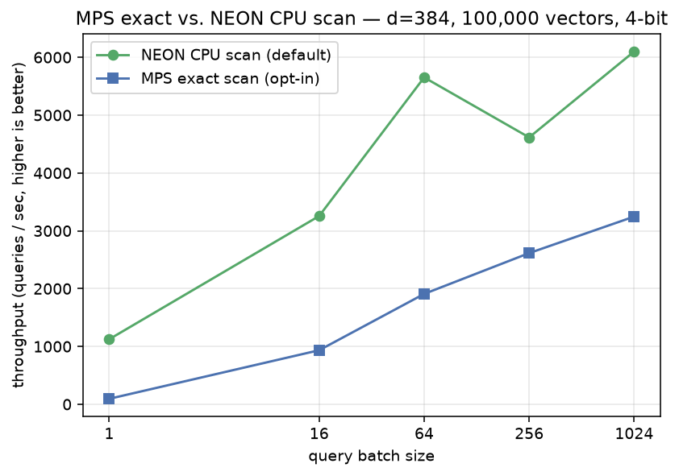

# MPS exact scan vs. TurboVec NEON scan (Apple Silicon)

Does running the vector scan on the **Apple GPU (Metal/MPS)** beat the default **CPU NEON
scan** on a Mac? This benchmark answers it on your hardware. It compares the same vendored
TurboVec index two ways, with no Modal and no CUDA:

- **NEON** (default): TurboVec's native CPU SIMD scan, `index.search(queries, k)`.
- **MPS exact** (opt-in): `lodedb.engine.mps_turbovec.MpsDirectTurboVecSession`, dequantized
  fp16 rows resident on the Apple GPU, scored with a batched matmul + `torch.topk`. It mirrors
  the CUDA `gpu_turbovec` path.

## Run

```bash
uv pip install matplotlib   # dev-only, for the chart
python benchmarks/mps_vs_neon/run.py --n 100000 --dim 384 --queries 1000
python benchmarks/mps_vs_neon/diagrams.py
```

## Result: Apple M1 (`measured`)

100K × 384, 4-bit, k=64, median of 3 passes:

| batch | NEON CPU (q/s) | MPS exact (q/s) | MPS/NEON |
|---:|---:|---:|---:|
| 1 | 1,125 | 95 | 0.08× |
| 16 | 3,256 | 935 | 0.29× |
| 64 | 5,653 | 1,909 | 0.34× |
| 256 | 4,615 | 2,615 | 0.57× |
| 1024 | 6,100 | 3,246 | **0.53×** |



**On the M1, NEON wins at every batch size.** The M1 GPU isn't strong enough to overcome the
per-batch dispatch overhead and the fp16 reconstruct, while Apple's CPU NEON scan over compact
4-bit codes is genuinely fast (and ~8× less memory). MPS does close the gap as batch grows
(0.08× → 0.53×), so a **much stronger Apple GPU (M-series Pro/Max, M5+) could push the crossover
past 1.0× at high batch**. That is the open question this benchmark exists to answer. Run it
on your hardware.

**Recall is preserved.** The MPS path scores dequantized rows exactly (no uint8 LUT error), so
its recall is at least the NEON scan's:

| metric | NEON | MPS exact |
|---|---:|---:|
| R@1-in-top1 | 0.737 | **0.774** |
| R@1-in-top8 | 0.999 | 1.000 |

## Status

The MPS backend is **opt-in and not wired into device selection**; the CPU NEON scan stays the
default on Mac. Construct `MpsDirectTurboVecSession` explicitly to use it. It should become a
default only if it beats NEON at a realistic operating point on your hardware.
