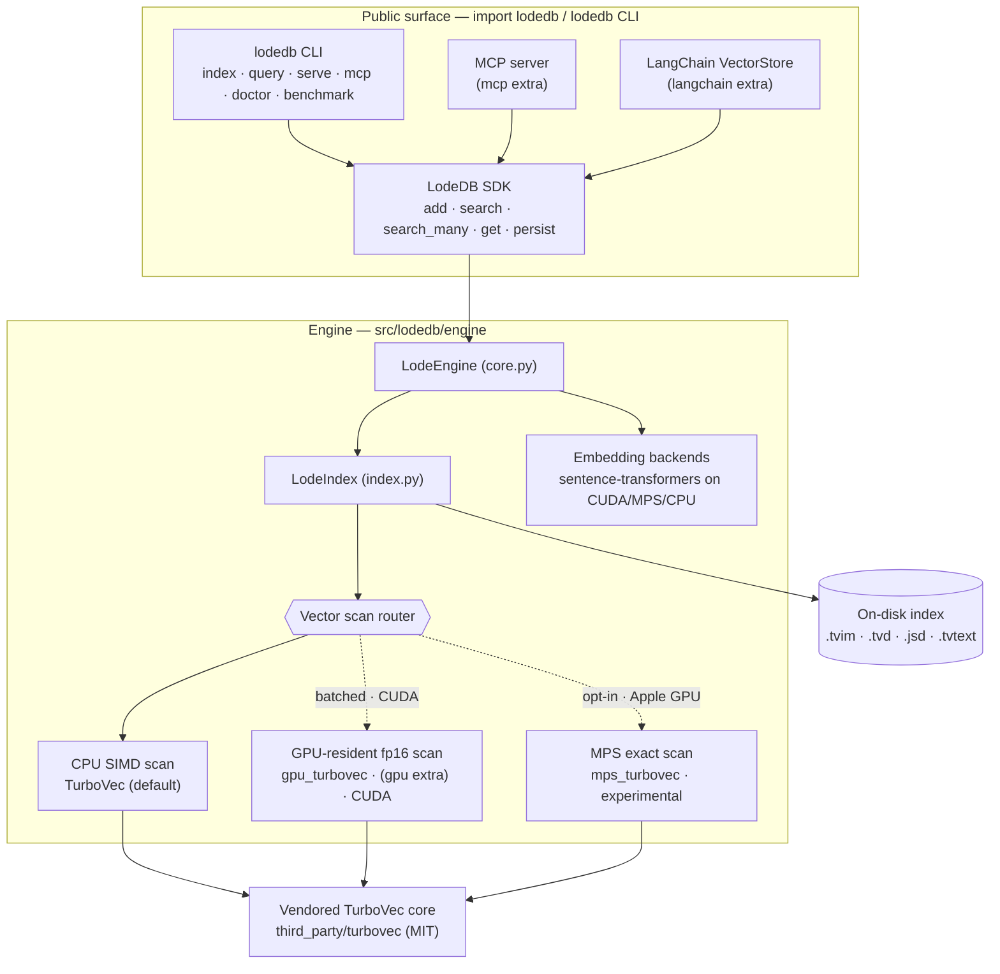
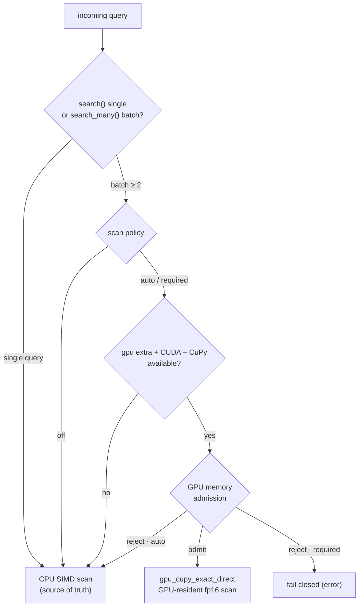

# Architecture

## System overview



The public surface (`import lodedb`, the `lodedb` CLI, the optional MCP server, and the
LangChain adapter) all sit on one SDK (`LodeDB`), which drives the engine (`LodeEngine` →
`LodeIndex`). Embedding (device-selected sentence-transformers) is kept separate from vector
serving: the scan runs on the compact CPU TurboVec kernel by default, with an optional
GPU-resident fp16 scan for batched queries on CUDA. State persists to four on-disk sidecars.

## Package layout

`pip install lodedb` installs one package, `lodedb`, imported as `import lodedb`. The CLI
entry point is `lodedb`.

```
src/lodedb/
  __init__.py            # public API: LodeDB, LodeSearchHit, the CLI
  config.py              # minimal YAML loader
  local/                 # local-first product surface
    db.py                #   LodeDB: add / search / search_many / remove / persist
    backends.py            #   embedding device selection (MPS / CUDA / CPU)
    presets.py           #   minilm / bge route presets
    cli.py, server.py    #   `lodedb` CLI + loopback dev server
    mcp_server.py        #   optional stdio MCP server (agent memory)
    doctor.py, benchmark.py     #   capability report + local benchmark
    integrations/langchain.py   #   optional LangChain VectorStore adapter
  engine/                # engine core
    core.py              #   LodeEngine — the in-process engine
    index.py             #   LodeIndex — build / search / persist surface
    turbovec_index.py    #   TurboVec scan binding
    turbovec_delta_store.py     #   encoded-row delta store (.tvd)
    state_journal_store.py      #   durable state journal (.jsd)
    embedding_backends.py       #   Hash / SentenceTransformer backends
    gpu_turbovec.py      #   optional CUDA batched exact scan (lazy; `[gpu]` extra)
    mps_turbovec.py      #   opt-in Apple-GPU (MPS) exact scan (lazy, experimental)
    route_registry.py, route_profiles.py, runtime_policy.py   #   route policy
third_party/turbovec/    # vendored MIT compact core + Apache-2.0 lifecycle patches
```

## Dependency boundary

Runtime PyPI dependencies: `numpy`, `typer`, `sentence-transformers`, `pyyaml`. Extras:
`[mcp]`, `[langchain]`, `[gpu]`. The compact TurboVec core is not a PyPI dependency: maturin
compiles the vendored Rust crate and bundles it into the wheel as the `lodedb._turbovec`
extension (see `pyproject.toml` `[tool.maturin]`).

Importing LodeDB loads none of `faiss`, `modal`, `mteb`, `datasets`, `matplotlib`, or
`sklearn`: the embedding stack and the optional CUDA scan load lazily, at first build/query.
`tests/test_import_boundary.py` checks this in a fresh subprocess. (`scikit-learn` is pulled
in transitively by `sentence-transformers`, but importing LodeDB does not import it.)

## Storage

Durable on-disk format:

- `.tvim` — the TurboVec index (quantized vectors + metadata),
- `.tvd` — the encoded-row delta store,
- `.jsd` — the state journal.

`db.persist()` writes a snapshot; reopening the same path replays it safely.

## Embedding & scan

LodeDB separates embedding device selection from vector serving. Embedding uses
`sentence-transformers` on CUDA, MPS, or CPU according to the local device policy.

On CUDA hosts (Linux), the optional `[gpu]` extra adds a GPU-resident exact scan
(`engine/gpu_turbovec.py`) for batched serving. The engine reconstructs compact TurboVec
rows once into an fp16 resident matrix, rotates query batches, scores with tiled GEMM, and
keeps a streaming top-k on device. `LodeDB.search_many(...)` is the public SDK path that can
hit this route. Single queries, missing GPU dependencies, memory rejection, and explicit
`off` policy use the compact CPU SIMD scan as source of truth/fallback.

On Apple Silicon, MPS accelerates embedding only. Vector search on Mac defaults to the CPU
TurboVec kernel (NEON on Apple Silicon); the MPS exact scan is experimental and not the
launch path.

Vector-scan routing (what the launch sweep in `benchmarks/direct_gpu_sweep/` asserts):



## Persistence & payload boundary

The durable index stores ids, metadata, compact vectors, and journals. The redacted artifacts
are always payload-free: the `.json` snapshot, the `.jsd` journal, the `.tvim`/`.tvd` vector
sidecars, telemetry, and `audit_persisted_index_snapshots` never carry raw document or query text.

Durable page-content retrieval is **on by default**. `LodeDB(...)` (engine flag
`EngineSecurityConfig.allow_raw_result_text`, default true) retains the original text passed to
`add`/`add_many` in a dedicated `<index_key>.tvtext` sidecar that maps `document_id -> text`,
written atomically and checksum-guarded (it fails closed on a corrupt/mismatched file, like the
other sidecars). The sidecar is deliberately **separate** from the redacted artifacts above —
none of them read it — so retrieval (`db.get`/`get_text`/`get_texts`, the `lodedb get` CLI
command, `POST /get`, and the MCP `lodedb_get` tool) never weakens any payload-free guarantee.
Removing a document drops its stored text. Opening with `store_text=False` opts out entirely:
no text is retained, the retrieval paths raise/return empty, and any existing sidecar is left
unread (and cleared on the next persist).
