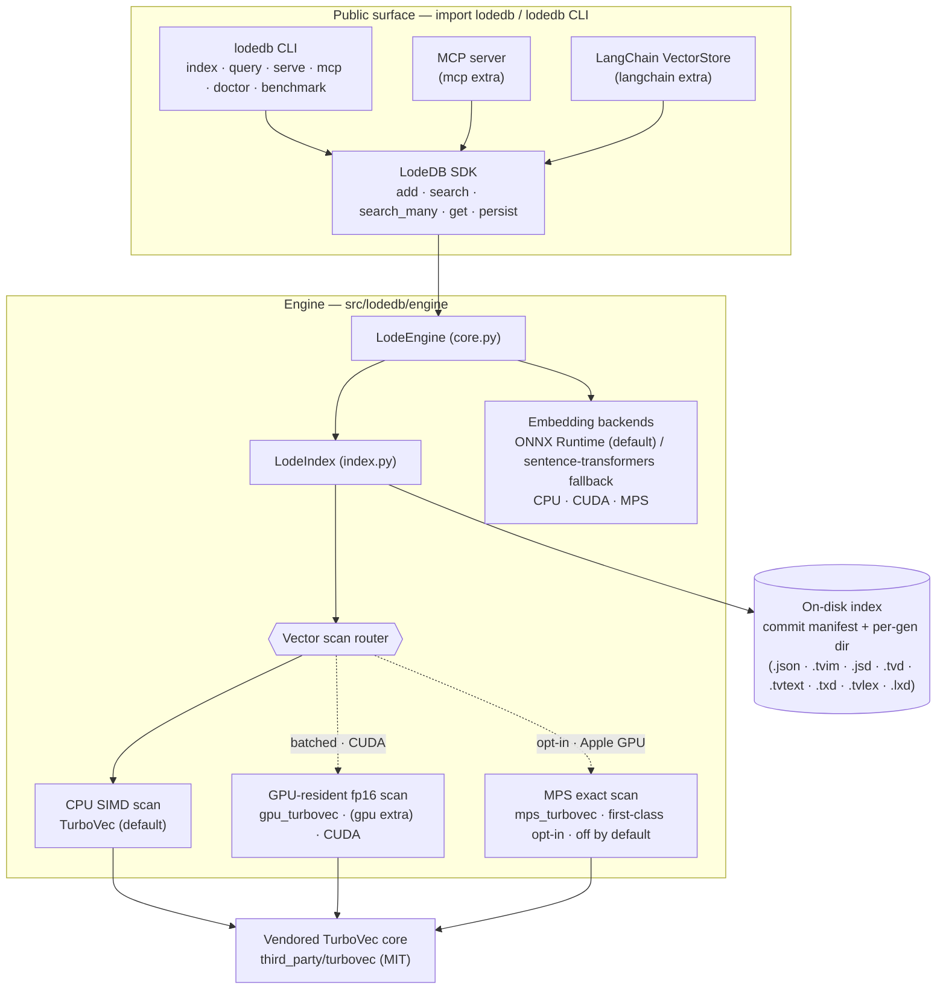
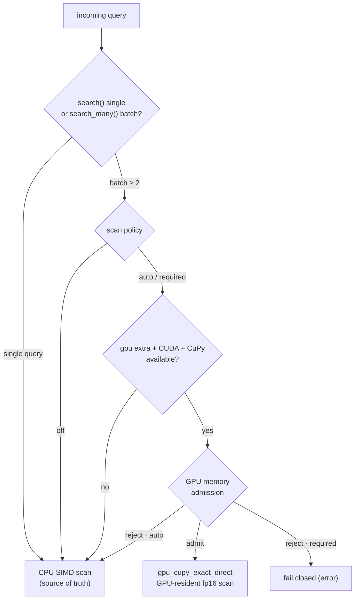

# Architecture

_For the optional managed cloud companion, see [cloud-roadmap.md](cloud-roadmap.md)._

## System overview



The public surface (`import lodedb`, the `lodedb` CLI, the optional MCP server, and the
LangChain adapter) all sit on one SDK (`LodeDB`), which drives the engine (`LodeEngine` →
`LodeIndex`). Embedding (ONNX Runtime by default, with a device-selected sentence-transformers
fallback) is kept separate from vector serving: the scan runs on the compact CPU TurboVec kernel
by default, with an optional GPU-resident fp16 scan for batched queries on CUDA. The index is
modality-agnostic: the same path stores text, CLIP image+text vectors (`model="clip"`), or
bring-your-own vectors, and `LodeCollection` groups several such indexes under one root. State
persists to generation-addressed artifacts (the redacted JSON state and compact vector base, plus
the opt-in `.tvtext` raw-text and `.tvlex` lexical-postings sidecars).

## Native-core rollout

The Rust native core now ships inside the bundled wheel path and is the default rollout mode
(`LODEDB_NATIVE_CORE=on`). The Python SDK keeps the same public API and still owns embedding,
CLI/server/integration ergonomics, and durable persistence while the final storage cutover is in
progress. For fresh vector-only stores, `LodeDB.open_vector_store(...)` mirrors vector mutations
into a private native `CoreEngine` handle and serves vector queries from native core when the
extension is available and the handle fully covers the current in-memory state. Python remains the
durable oracle: every mutation still commits through the existing Python engine, and existing
persisted stores fall back to Python until native storage can seed exact vectors from disk.

Rollout flags:

- `LODEDB_NATIVE_CORE=on` (default) uses native-covered paths and falls back safely for unsupported
  or unseeded paths. If explicitly set to `on`, extension initialization failures fail closed.
- `LODEDB_NATIVE_CORE=shadow` keeps Python authoritative and checks native parity for covered
  vector-only handles.
- `LODEDB_NATIVE_CORE=off` disables native execution for the deprecation cycle.
- `LODEDB_NATIVE_CORE_STRICT_PARITY=1` raises on shadow mismatches instead of only recording the
  fallback reason in `db.stats()["native_core"]`.

The duplicate Python runtime paths have therefore not been removed yet; they are the compatibility
and persistence fallback for this release window. See
[`native_core_migration.md`](native_core_migration.md) for the current migration status and
remaining removal gate.

The Swift package binds to the same native core through `lodedb-ffi`. In local development,
`LODEDB_FFI_DYLIB` points the Swift wrapper at a built Rust dylib; for distribution,
`swift/LodeDBCore/scripts/package_xcframework.sh` builds installed Apple Rust targets into a
native `LodeDBCoreFFI.xcframework`. Swift embedders still run outside the core, matching the
Python prepare/apply split, and Swift text search uses the native query-plan/search protocol for
vector, lexical, and hybrid modes while its native handle fully covers the current state.

## Package layout

`pip install lodedb` installs one package, `lodedb`, imported as `import lodedb`. The CLI
entry point is `lodedb`. The base install is a vector store with no embedding runtime; built-in
text embedding is the opt-in `[embeddings]` (ONNX) and `[torch]` (PyTorch) extras.

```
src/lodedb/
  __init__.py            # public API: LodeDB, LodeSearchHit, the CLI
  config.py              # minimal YAML loader
  local/                 # local-first product surface
    db.py                #   LodeDB: add / search / add_image / vector-in / remove / persist
    backends.py            #   embedding runtime + device selection (ONNX / torch; MPS / CUDA / CPU)
    onnx_artifacts.py    #   fetch/export + cache the preset ONNX model on first use
    presets.py           #   minilm / bge / clip route presets (+ custom embedder=)
    collection.py        #   LodeCollection: named vector spaces under one root
    cli.py, server.py    #   `lodedb` CLI + loopback/private-network dev server
    mcp_server.py        #   optional stdio MCP server (agent memory)
    doctor.py, benchmark.py     #   capability report + local benchmark
    integrations/langchain.py   #   optional LangChain VectorStore adapter
  engine/                # engine core
    core.py              #   LodeEngine — the in-process engine
    index.py             #   LodeIndex — build / search / persist surface
    turbovec_index.py    #   TurboVec scan binding
    turbovec_delta_store.py     #   encoded-row delta store (.tvd)
    state_journal_store.py      #   durable state journal (.jsd)
    embedding_backends.py       #   Hash / SentenceTransformer / ONNXRuntime backends
    gpu_turbovec.py      #   optional CUDA batched exact scan (lazy; `[gpu]` extra)
    mps_turbovec.py      #   first-class opt-in Apple-GPU (MPS) exact scan (lazy, off by default)
    route_registry.py, route_profiles.py, runtime_policy.py   #   route policy
third_party/turbovec/    # vendored MIT compact core + Apache-2.0 lifecycle patches
```

## Dependency boundary

Runtime PyPI dependencies: `numpy`, `typer`, `onnxruntime`, `transformers`,
`sentence-transformers`, `pyyaml`. Extras: `[onnx-export]` (Optimum, for exporting an ONNX graph
for a model that does not ship one), `[image]` (Pillow, for `model="clip"` / `add_image`), `[mcp]`,
`[langchain]`, `[llama-index]`, `[mem0]`, `[gpu]`. The compact TurboVec core is not a PyPI
dependency: maturin compiles the vendored Rust crate and bundles it into the wheel as the
`lodedb._turbovec` extension (see `pyproject.toml` `[tool.maturin]`).

Importing LodeDB loads none of `faiss`, `modal`, `mteb`, `datasets`, `matplotlib`, or
`sklearn`: the embedding runtimes (`onnxruntime`, `transformers`, `sentence-transformers`), the
optional CUDA scan, and the optional image stack (Pillow, plus the CLIP model) load lazily, at
first build/query, and Optimum only ever runs in an export subprocess. `tests/test_import_boundary.py` checks this in a fresh subprocess. (`scikit-learn` is
pulled in transitively by `sentence-transformers`, but importing LodeDB does not import it.)

## Storage

Each index is a per-index generation directory plus a single atomically-swapped root pointer:

- `<key>.commit.json` is the **root commit manifest**: the one file whose atomic swap commits
  a generation. It pins (with checksums) the consistent set of artifacts for that generation.
- `<key>.gen/` holds the generation-addressed artifacts for that index:
  - `g<epoch>.json`: the redacted JSON state base, plus its `.jsd` document journal under
    `g<epoch>.json.json-delta/`,
  - `g<epoch>.tvim`: the TurboVec vector base (quantized vectors + metadata), plus its `.tvd`
    encoded-row journal under `g<epoch>.tvim.tvim-delta/`,
  - `g<epoch>.tvtext`: the raw-text base (`store_text`, on by default) holding the full
    `document_id -> text` map, plus its `.txd` text journal under `g<epoch>.tvtext.tvtext-delta/`,
    governed by the same root manifest,
  - `g<epoch>.tvlex`: the lexical-index base (`index_text`, which defaults to match `store_text`)
    holding the full `document_id -> per-chunk token lists` map, plus its `.lxd` token journal
    under `g<epoch>.tvlex.tvlex-delta/`, governed by the same root manifest.

A commit writes any new artifacts first (bases are generation-addressed and never
overwritten in place), then atomically swaps `<key>.commit.json`; that swap is the only
commit point. A crash mid-commit leaves the previously committed generation fully intact: on
reopen a writer rolls back to it (dropping the uncommitted artifacts) rather than failing
closed, and a lock-free reader loads exactly the generation the root names, so it gets
consistent snapshot isolation, raw text included. Superseded generations are
garbage-collected, keeping the most recent few for in-flight readers. The redacted artifacts (`.json`/`.jsd`/`.tvim`/
`.tvd`) never carry raw document or query text; only the `.tvtext` base + `.txd` journal hold
raw text, and only the `.tvlex` base + `.lxd` journal hold payload-derived lexical terms.

`db.persist()` returns durable stats (every mutation already commits atomically); reopening
the same path replays the committed generation. Stores written before this layout (a
top-level `<key>.json`) load via a legacy fallback and migrate on their next write.

## Embedding & scan

LodeDB separates the embedding runtime from vector serving. Embedding defaults to ONNX Runtime:
the preset models ship a prebuilt ONNX graph on the Hub that is fetched and cached on first use
(`local/onnx_artifacts.py`), and the same tokenizer, pooling, and L2 normalization as the
sentence-transformers path keep the vectors comparable, so an index stays portable between
runtimes. When `onnxruntime` is absent or the ONNX graph cannot be obtained, embedding falls back
to `sentence-transformers` (PyTorch) on CUDA, MPS, or CPU. `embedding_runtime="auto"|"onnx"|"torch"`
selects the runtime and `lodedb doctor` reports the preferred one (with its torch fallback) plus the
active ONNX execution providers. ONNX lowers single-query and incremental-add latency; large-batch cold-indexing
throughput is hardware-dependent and can favor torch on CPU, so batch-indexing-heavy workloads can
pin `embedding_runtime="torch"`.

On CUDA hosts (Linux), the optional `[gpu]` extra adds a GPU-resident exact scan
(`engine/gpu_turbovec.py`) for batched serving. The engine reconstructs compact TurboVec
rows once into an fp16 resident matrix, rotates query batches, scores with tiled GEMM, and
keeps a streaming top-k on device. `LodeDB.search_many(...)` is the public SDK path that can
hit this route. Single queries, missing GPU dependencies, memory rejection, and explicit
`off` policy use the compact CPU SIMD scan as source of truth/fallback.

On Apple Silicon, the default ONNX embedding runs on the **CPU** execution provider; the
sentence-transformers fallback uses MPS. An opt-in ONNX Core ML provider exists
(`LODEDB_ONNX_COREML=1`) but stays off by default for the same reason the MPS vector scan does:
on the dynamic-shape preset graphs it fragments into many Core ML/CPU partitions and measured
slower than the CPU provider for single-query embedding (about 16 ms vs 3 ms on an M-series CPU),
so it should be re-measured (ideally with a fixed-shape export) before any default change. Vector
search on Mac defaults to the CPU TurboVec kernel (NEON on Apple Silicon). A first-class opt-in MPS exact scan is available for
batched `search_many` via `LODEDB_MPS_DIRECT_TURBOVEC=auto|required`, but it stays off by default:
on the measured M1 it was slower than NEON at every batch size, and newer Apple GPUs should be
re-measured before any default change.

An opt-in ANN layer (`ann="cluster"`) sits *in front of* whichever exact scan runs. When enabled
for an index, an unfiltered query scores an in-memory IVF cluster index, unions the nearest
`nprobe` clusters into a candidate set, and hands that set to the exact scan above as an
allowlist; the exact scan re-scores the candidates. Scores are therefore exact but the result is
approximate (a true neighbor in an unprobed cluster can be missed). It is off by default, the
exact scan remains the authority, and probing every cluster reproduces the exact top-k. The
cluster index is in-memory and rebuilt on open; only the opt-in config is persisted. Base builds
lay each cluster's vector rows contiguously, so an ANN allowlist can skip more SIMD blocks without
changing scores or candidate membership. `ann_nprobe` is persisted at creation but may be replaced
for one open handle as a non-persistent session override.

An optional `rescore="original"` sidecar captures the vector supplied at ingest before TurboVec
quantizes it. `float16`, the default, costs about 2 bytes per dimension per vector; `float32` costs
4 and `int8` costs 1. A query first runs the compact scan for `ceil(k * oversample)` candidates,
then loads those sidecar rows and ranks them by exact fp32 dot product. That can repair close-result
ordering above the practical 4-bit ranking ceiling, but it cannot restore a neighbor absent from an
ANN candidate set. Capture is create-time only because an ordinary store does not retain originals;
on reopen mode and dtype remain durable identity while oversample may be a session-only override.

Vector-scan routing (what the launch sweep in `benchmarks/direct_gpu_sweep/` asserts):



## Persistence & payload boundary

The durable index stores ids, metadata, compact vectors, and journals. The redacted artifacts
are always payload-free: the `.json` snapshot, the `.jsd` journal, the `.tvim`/`.tvd` vector
sidecars, telemetry, and `audit_persisted_index_snapshots` never carry raw document or query text.

Durable page-content retrieval is **on by default**. `LodeDB(...)` (engine flag
`EngineSecurityConfig.allow_raw_result_text`, default true) retains the original text passed to
`add`/`add_many` in a dedicated raw-text store mapping `document_id -> text`: a `g<epoch>.tvtext`
base plus a `.txd` delta journal, mirroring the state/vector journals so an incremental commit
journals only the upserted texts and deleted ids (O(changed), not a full-map rewrite) and a load
replays the deltas onto the base. Every base and segment is checksum-guarded and fails closed on
a corrupt/mismatched file. The store is deliberately **separate** from the redacted artifacts
above (none of them read it), so retrieval (`db.get`/`get_text`/`get_texts`, the `lodedb get`
CLI command, `POST /get`, and the MCP `lodedb_get` tool) never weakens any payload-free
guarantee. Removing a document journals a delete. Opening with `store_text=False` opts out
entirely: no text is retained, the retrieval paths raise/return empty, and any existing store is
left unread (and dropped when its generation is GC'd).

Hybrid lexical search keeps this boundary intact. The BM25 inverted index behind `mode="hybrid"`
and `mode="lexical"` is payload-derived, so the serving index is built in memory on the first such
query of a generation and discarded when the generation advances. It is never written to the
`.json`/`.jsd`/`.tvim`/`.tvd` artifacts or to telemetry, which stays metrics-only (counts, bytes,
latency, never tokens or terms).

That serving index needs a source, and `index_text` defaults to match `store_text` (both on by
default), so the default source is a durable one: the per-chunk tokens of each document are
captured at `add` time and kept in a dedicated lexical sidecar mapping
`document_id -> per-chunk token lists`, a `g<epoch>.tvlex` base plus a `.lxd` delta journal. With
`index_text=False` the serving index is instead rebuilt from the raw-text store on open, so hybrid
and lexical still work whenever `store_text=True`, just re-tokenized rather than loaded. This mirrors the `.tvtext`/`.txd` raw-text pattern exactly: an incremental
commit journals only the upserted token lists and deleted ids (O(changed), not a full-map
rewrite), a load replays the deltas onto the base, every base and segment is checksum-guarded and
fails closed on a corrupt/mismatched file, and the manifest is pinned by the same root commit so
the sidecar commits and rolls back atomically with the generation. Because the tokens are captured
at ingest, the lexical sidecar is independent of `store_text`: hybrid and lexical search survive a
reopen rebuilt purely from the persisted terms, with no raw text and no re-tokenization. Like the
raw-text store it is deliberately separate from the redacted artifacts above and never reaches
telemetry, so persisting the lexical index weakens no payload-free guarantee. A lexical query with
neither `index_text=True` nor `store_text=True` raises a clear error.

**The write-ahead log (`<key>.wal`) is payload-bearing between checkpoints.** In the default
`commit_mode="wal"`, a mutation is appended to `<key>.wal` and a full generation is checkpointed
only periodically, so the WAL holds in-flight payload and must be treated as sensitively as the
data it indexes:

- With `store_text=True`, a text `add` logs the document's raw text (replay re-embeds it).
- With `store_text=False`, a text `add` logs the chunk embedding delta instead and, when
  `index_text=True`, the per-chunk lexical tokens (payload-derived terms, never raw text) so a
  crash recovers lexical/hybrid search without retaining text.
- A vector-in or image upsert logs the vector and redacted metadata, plus the caption text only
  when `store_text=True` and the caption tokens only when `index_text=True`.

`db.persist()` and `db.close()` checkpoint the WAL into a committed generation and truncate it, so
a cleanly closed store has an empty WAL and the durable artifacts above are fully current. A crash
replays the WAL on the next writable open and then checkpoints, so recovery yields a normal
committed generation. Read-only handles never read the WAL; they load the last checkpointed
generation, not a writer's in-flight log. `commit_mode="generation"` publishes a full generation on
every write and keeps no WAL, so it retains no between-write payload in a log at all (at a higher
per-write cost). For backups, support bundles, and incident response, classify `<key>.wal` as
carrying the same data class as the `.tvtext`/`.tvlex` sidecars under the active
`store_text`/`index_text` settings.

**Concurrent multi-writer append.** The single exclusive writer is not the only way to add records
in WAL mode. A shared-lock *appender* (`CoreAppender`, exposed over the C ABI, in Python as
`lodedb.Appender`, and in Swift as `LodeAppender`) lets many processes durably log vector-in
records to one `<key>.wal` at once. Appenders take a shared lock while a checkpointing
writer takes the exclusive lock, so an append never races a truncation; each record's log sequence
number (LSN) comes from a durable, process-shared allocator (`<key>.lsn`) whose floor is the
store's committed max LSN, so appended LSNs never collide with a writer's generation LSNs. The next
writable open replays the WAL (skipping records already folded in, by LSN) and checkpoints onto a
fresh generation. A record is durable once acknowledged under `durability="fsync"` (the default
`fast` mode is atomic but not fsynced) and becomes queryable after the next writable open folds it
in, or immediately in a read-only handle whose `refresh()` overlays the WAL tail into its in-memory
view without checkpointing (its `applied_lsn()` then reports read-your-writes against an append's
returned LSN). The overlay reloads the base and re-tails under a manifest-checksum seqlock, so a
checkpoint racing the refresh cannot drop committed records. On Windows a shared
hold degrades to an exclusive one, so appenders serialize there rather than coexisting. A writable
generation-mode open refuses a store with unfolded WAL records rather than committing past them.
Each record carries a precomputed vector plus metadata, and (only when the appender opts into
`store_text`, off by default) a caption. So the appender honors the same `store_text` payload
boundary as the single-writer paths above: it writes raw text to `<key>.wal` only when text
retention is on, never otherwise.

The appender also ingests full text, so text writes are multi-producer too. Because the core cannot
embed (embeddings live in the binding layer), the appender takes the *post-embedding* shape: it
chunks the documents (`prepare_documents`, using the store writer's `chunk_character_limit` so chunk
ids match), the binding embeds the returned chunks, and `append_embedded_documents` logs one
`apply_embedded_documents` record. This path is replay-independent (it captures no base generation
and is never `PlanStale` like the single-writer `prepare_text_upsert`/`apply_text_upsert`) because
the folding writer resolves a replacement's retired chunks from its own index state (so the appended
record carries an empty removed-chunk list) and normalizes each record's text/tokens to its own
`store_text`/`index_text` on fold. It is `append_text`/`append_text_many` in Python (`lodedb.Appender`,
given an `embedder=`) and `append(text:...)` in Swift (`LodeAppender`, given a `LodeEmbedder`).

**Running checkpointer.** Folding the WAL used to require re-opening a writable engine. A *running
checkpointer* (`CoreCheckpointer`, exposed over the C ABI, in Python as `lodedb.Checkpointer`, and in
Swift as `LodeCheckpointer`) removes that: one process folds the WAL into fresh committed generations
continuously while appenders keep logging, so appended records become durable (and visible to a
reader's `refresh`) without an application ever taking a writable open. It holds a crash-reclaimable
*lease* on a `<dir>/.lodedb.checkpoint.lock` sentinel (distinct from the writer lock, so it excludes
neither appenders nor the writer and only elects one checkpointer at a time) and takes the exclusive
writer lock solely for the brief window of each `checkpoint()`. Single-applier ordering is preserved
because every fold runs under that same exclusive lock a writable open would take; the fold is
incremental (only records above the applied-LSN watermark, onto the already-warm index), and if a
concurrent writer advanced the committed base since the last fold, the warm state is reloaded first so
a fold never targets a stale base. A dead lessee's lease is reclaimed by the OS, so a fresh
checkpointer takes over after a crash. The core exposes the mechanism (a one-shot `checkpoint()`
returning the number of records folded); a binding drives it on a loop or timer.

Because a checkpointer folds while appenders stay open, an appender no longer holds the shared lock for
its lifetime: it takes the shared lock per append (re-reading the committed generation each time, so a
reservation always clears a fold that advanced it between appends) and releases it in between, which is
what lets the checkpointer take the exclusive lock to fold. This makes the appender's O(1) torn-tail
repair span concurrent WAL growth: when bytes sit past its in-session watermark, it scans and truncates
only to the last CRC-valid frame rather than dropping the tail back to a now-stale
boundary. Records a concurrent writer or checkpointer left there survive.
