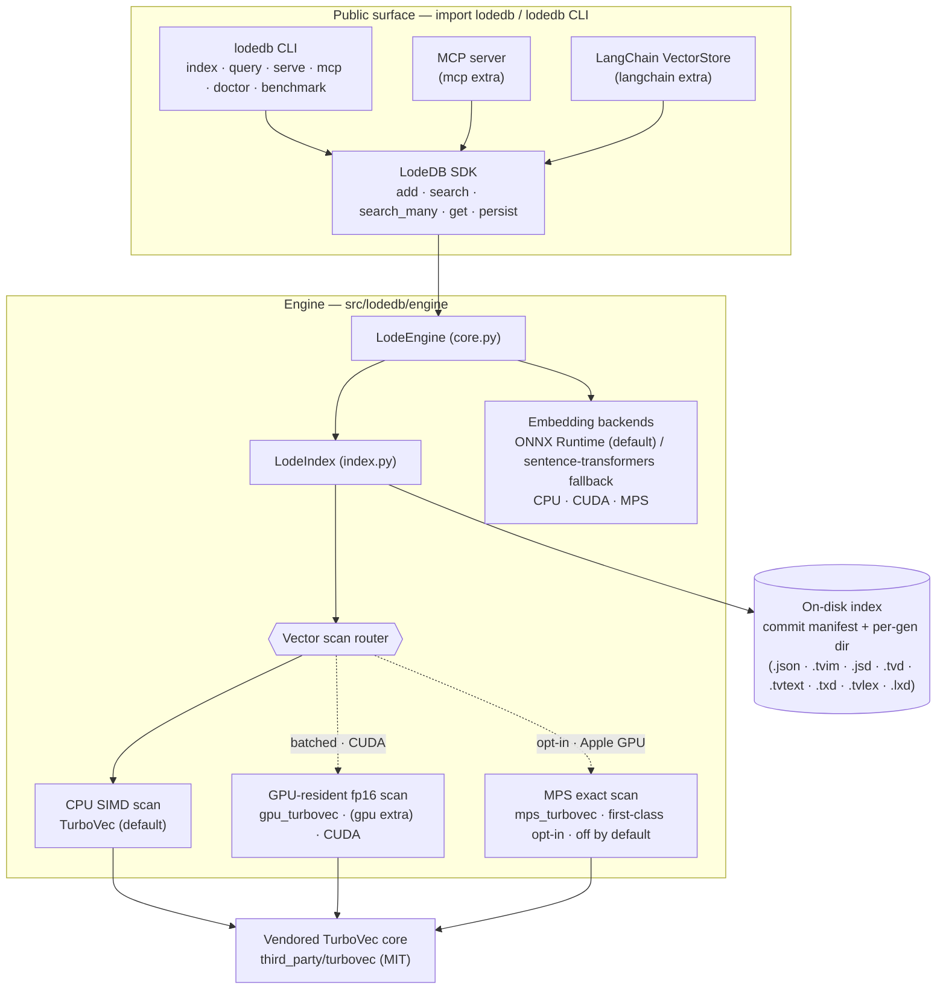
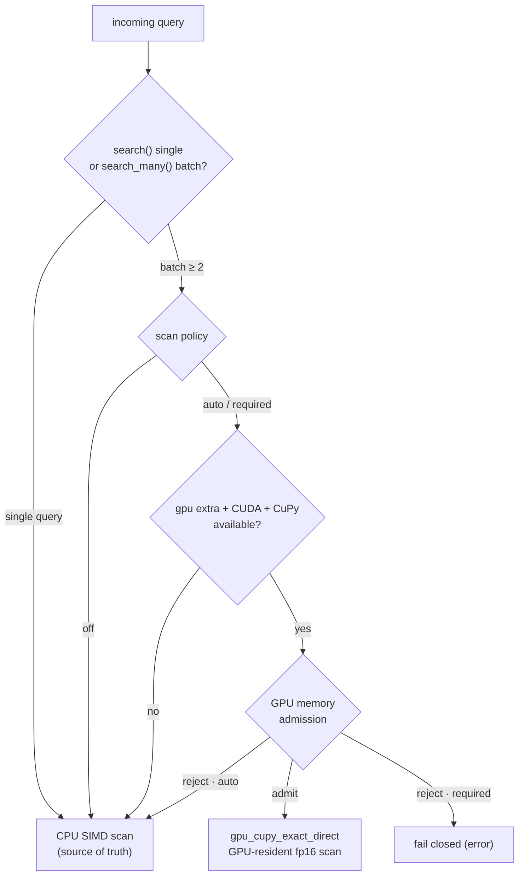

# Architecture

## System overview



The public surface (`import lodedb`, the `lodedb` CLI, the optional MCP server, and the
LangChain adapter) all sit on one SDK (`LodeDB`), which drives the engine (`LodeEngine` →
`LodeIndex`). Embedding (ONNX Runtime by default, with a device-selected sentence-transformers
fallback) is kept separate from vector serving: the scan runs on the compact CPU TurboVec kernel
by default, with an optional GPU-resident fp16 scan for batched queries on CUDA. State persists to
four on-disk sidecars.

## Package layout

`pip install lodedb` installs one package, `lodedb`, imported as `import lodedb`. The CLI
entry point is `lodedb`.

```
src/lodedb/
  __init__.py            # public API: LodeDB, LodeSearchHit, the CLI
  config.py              # minimal YAML loader
  local/                 # local-first product surface
    db.py                #   LodeDB: add / search / search_many / remove / persist
    backends.py            #   embedding runtime + device selection (ONNX / torch; MPS / CUDA / CPU)
    onnx_artifacts.py    #   fetch/export + cache the preset ONNX model on first use
    presets.py           #   minilm / bge route presets
    cli.py, server.py    #   `lodedb` CLI + loopback/private-network dev server
    mcp_server.py        #   optional stdio MCP server (agent memory)
    doctor.py, benchmark.py     #   capability report + local benchmark
    integrations/langchain.py   #   optional LangChain VectorStore adapter
  engine/                # engine core
    core.py              #   LodeEngine — the in-process engine
    index.py             #   LodeIndex — build / search / persist surface
    turbovec_index.py    #   TurboVec scan binding
    turbovec_delta_store.py     #   encoded-row delta store (.tvd)
    state_journal_store.py      #   durable state journal (.jsd)
    embedding_backends.py       #   Hash / SentenceTransformer / ONNXRuntime backends
    gpu_turbovec.py      #   optional CUDA batched exact scan (lazy; `[gpu]` extra)
    mps_turbovec.py      #   first-class opt-in Apple-GPU (MPS) exact scan (lazy, off by default)
    route_registry.py, route_profiles.py, runtime_policy.py   #   route policy
third_party/turbovec/    # vendored MIT compact core + Apache-2.0 lifecycle patches
```

## Dependency boundary

Runtime PyPI dependencies: `numpy`, `typer`, `onnxruntime`, `transformers`,
`sentence-transformers`, `pyyaml`. Extras: `[onnx-export]` (Optimum, for exporting an ONNX graph
for a model that does not ship one), `[mcp]`, `[langchain]`, `[gpu]`. The compact TurboVec core is
not a PyPI dependency: maturin compiles the vendored Rust crate and bundles it into the wheel as
the `lodedb._turbovec` extension (see `pyproject.toml` `[tool.maturin]`).

Importing LodeDB loads none of `faiss`, `modal`, `mteb`, `datasets`, `matplotlib`, or
`sklearn`: the embedding runtimes (`onnxruntime`, `transformers`, `sentence-transformers`) and the
optional CUDA scan load lazily, at first build/query, and Optimum only ever runs in an export
subprocess. `tests/test_import_boundary.py` checks this in a fresh subprocess. (`scikit-learn` is
pulled in transitively by `sentence-transformers`, but importing LodeDB does not import it.)

## Storage

Each index is a per-index generation directory plus a single atomically-swapped root pointer:

- `<key>.commit.json` — the **root commit manifest**: the one file whose atomic swap commits
  a generation. It pins (with checksums) the consistent set of artifacts for that generation.
- `<key>.gen/` — generation-addressed artifacts for that index:
  - `g<epoch>.json` — the redacted JSON state base, plus its `.jsd` document journal under
    `g<epoch>.json.json-delta/`,
  - `g<epoch>.tvim` — the TurboVec vector base (quantized vectors + metadata), plus its `.tvd`
    encoded-row journal under `g<epoch>.tvim.tvim-delta/`,
  - `g<epoch>.tvtext` — the opt-in raw-text base (`store_text=True`): the full
    `document_id -> text` map, plus its `.txd` text journal under `g<epoch>.tvtext.tvtext-delta/`,
    governed by the same root manifest,
  - `g<epoch>.tvlex` — the opt-in lexical-index base (`index_text=True`): the full
    `document_id -> per-chunk token lists` map, plus its `.lxd` token journal under
    `g<epoch>.tvlex.tvlex-delta/`, governed by the same root manifest.

A commit writes any new artifacts first — bases are generation-addressed and never
overwritten in place — then atomically swaps `<key>.commit.json`; that swap is the only
commit point. A crash mid-commit leaves the previously committed generation fully intact: on
reopen a writer rolls back to it (dropping the uncommitted artifacts) rather than failing
closed, and a lock-free reader loads exactly the generation the root names — consistent
snapshot isolation, raw text included. Superseded generations are garbage-collected, keeping
the most recent few for in-flight readers. The redacted artifacts (`.json`/`.jsd`/`.tvim`/
`.tvd`) never carry raw document or query text; only the `.tvtext` base + `.txd` journal hold
raw text, and only the `.tvlex` base + `.lxd` journal hold payload-derived lexical terms.

`db.persist()` returns durable stats (every mutation already commits atomically); reopening
the same path replays the committed generation. Stores written before this layout (a
top-level `<key>.json`) load via a legacy fallback and migrate on their next write.

## Embedding & scan

LodeDB separates the embedding runtime from vector serving. Embedding defaults to ONNX Runtime:
the preset models ship a prebuilt ONNX graph on the Hub that is fetched and cached on first use
(`local/onnx_artifacts.py`), and the same tokenizer, pooling, and L2 normalization as the
sentence-transformers path keep the vectors comparable, so an index stays portable between
runtimes. When `onnxruntime` is absent or the ONNX graph cannot be obtained, embedding falls back
to `sentence-transformers` (PyTorch) on CUDA, MPS, or CPU. `embedding_runtime="auto"|"onnx"|"torch"`
selects the runtime and `lodedb doctor` reports the preferred one (with its torch fallback) plus the
active ONNX execution providers. ONNX lowers single-query and incremental-add latency; large-batch cold-indexing
throughput is hardware-dependent and can favor torch on CPU, so batch-indexing-heavy workloads can
pin `embedding_runtime="torch"`.

On CUDA hosts (Linux), the optional `[gpu]` extra adds a GPU-resident exact scan
(`engine/gpu_turbovec.py`) for batched serving. The engine reconstructs compact TurboVec
rows once into an fp16 resident matrix, rotates query batches, scores with tiled GEMM, and
keeps a streaming top-k on device. `LodeDB.search_many(...)` is the public SDK path that can
hit this route. Single queries, missing GPU dependencies, memory rejection, and explicit
`off` policy use the compact CPU SIMD scan as source of truth/fallback.

On Apple Silicon, the default ONNX embedding runs on the **CPU** execution provider; the
sentence-transformers fallback uses MPS. An opt-in ONNX Core ML provider exists
(`LODEDB_ONNX_COREML=1`) but stays off by default for the same reason the MPS vector scan does:
on the dynamic-shape preset graphs it fragments into many Core ML/CPU partitions and measured
slower than the CPU provider for single-query embedding (about 16 ms vs 3 ms on an M-series CPU),
so it should be re-measured (ideally with a fixed-shape export) before any default change. Vector
search on Mac defaults to the CPU TurboVec kernel (NEON on Apple Silicon). A first-class opt-in MPS exact scan is available for
batched `search_many` via `LODEDB_MPS_DIRECT_TURBOVEC=auto|required`, but it stays off by default:
on the measured M1 it was slower than NEON at every batch size, and newer Apple GPUs should be
re-measured before any default change.

Vector-scan routing (what the launch sweep in `benchmarks/direct_gpu_sweep/` asserts):



## Persistence & payload boundary

The durable index stores ids, metadata, compact vectors, and journals. The redacted artifacts
are always payload-free: the `.json` snapshot, the `.jsd` journal, the `.tvim`/`.tvd` vector
sidecars, telemetry, and `audit_persisted_index_snapshots` never carry raw document or query text.

Durable page-content retrieval is **on by default**. `LodeDB(...)` (engine flag
`EngineSecurityConfig.allow_raw_result_text`, default true) retains the original text passed to
`add`/`add_many` in a dedicated raw-text store mapping `document_id -> text`: a `g<epoch>.tvtext`
base plus a `.txd` delta journal, mirroring the state/vector journals so an incremental commit
journals only the upserted texts and deleted ids (O(changed), not a full-map rewrite) and a load
replays the deltas onto the base. Every base and segment is checksum-guarded and fails closed on
a corrupt/mismatched file. The store is deliberately **separate** from the redacted artifacts
above — none of them read it — so retrieval (`db.get`/`get_text`/`get_texts`, the `lodedb get`
CLI command, `POST /get`, and the MCP `lodedb_get` tool) never weakens any payload-free
guarantee. Removing a document journals a delete. Opening with `store_text=False` opts out
entirely: no text is retained, the retrieval paths raise/return empty, and any existing store is
left unread (and dropped when its generation is GC'd).

Hybrid lexical search keeps this boundary intact. The BM25 inverted index behind `mode="hybrid"`
and `mode="lexical"` is payload-derived, so the serving index is built in memory on the first such
query of a generation and discarded when the generation advances. It is never written to the
`.json`/`.jsd`/`.tvim`/`.tvd` artifacts or to telemetry, which stays metrics-only (counts, bytes,
latency, never tokens or terms).

That serving index needs a source. By default it is rebuilt from the raw-text store, so hybrid and
lexical search work whenever `store_text=True`. Opening with `index_text=True` adds a durable
source: the per-chunk tokens of each document are captured at `add` time and kept in a dedicated
lexical sidecar mapping `document_id -> per-chunk token lists`, a `g<epoch>.tvlex` base plus a
`.lxd` delta journal. This mirrors the `.tvtext`/`.txd` raw-text pattern exactly: an incremental
commit journals only the upserted token lists and deleted ids (O(changed), not a full-map
rewrite), a load replays the deltas onto the base, every base and segment is checksum-guarded and
fails closed on a corrupt/mismatched file, and the manifest is pinned by the same root commit so
the sidecar commits and rolls back atomically with the generation. Because the tokens are captured
at ingest, the lexical sidecar is independent of `store_text`: hybrid and lexical search survive a
reopen rebuilt purely from the persisted terms, with no raw text and no re-tokenization. Like the
raw-text store it is deliberately separate from the redacted artifacts above and never reaches
telemetry, so persisting the lexical index weakens no payload-free guarantee. A lexical query with
neither `index_text=True` nor `store_text=True` raises a clear error.
