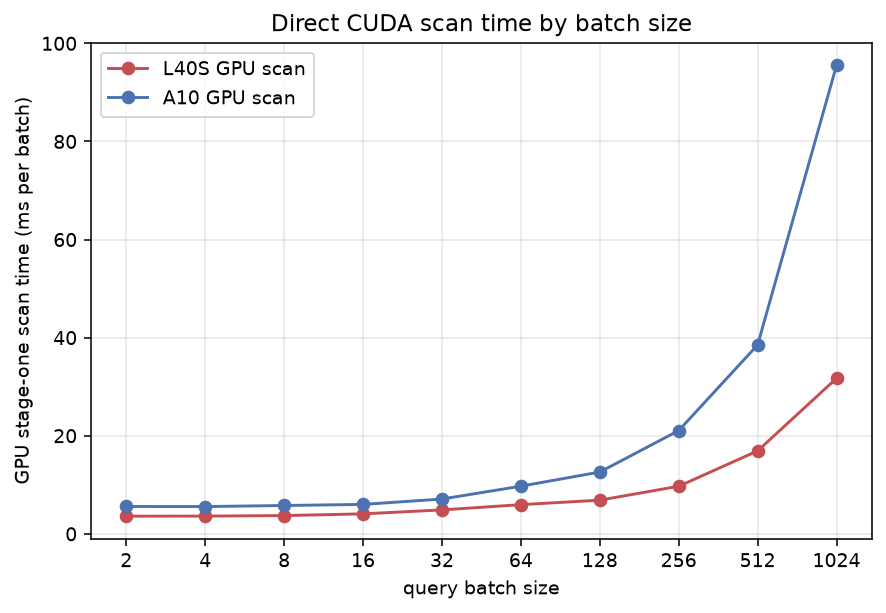
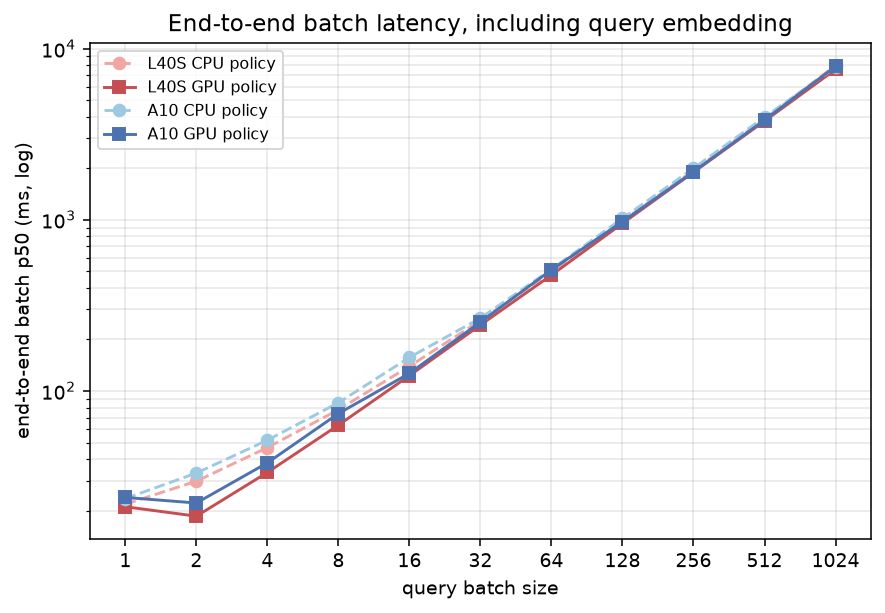
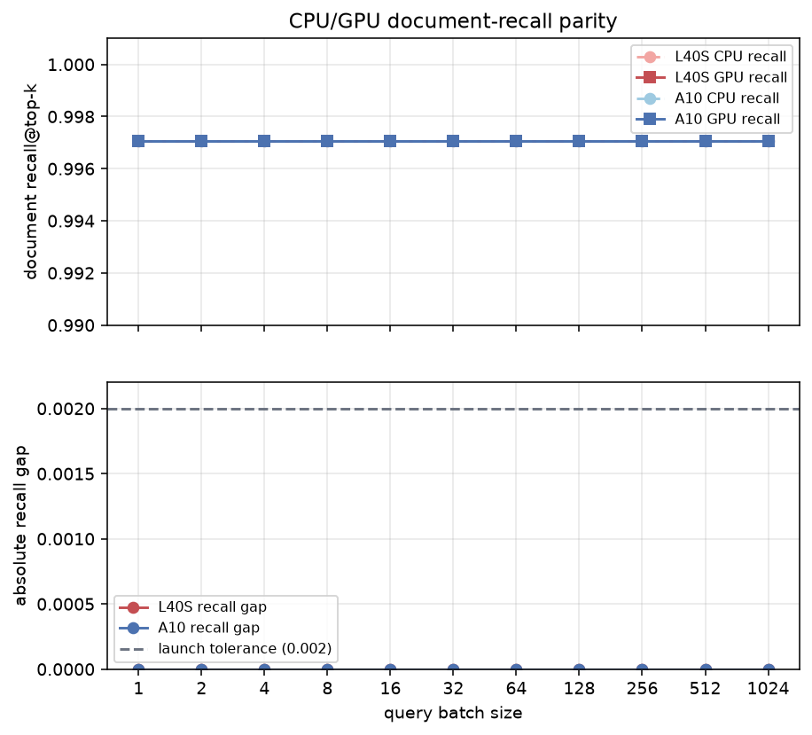
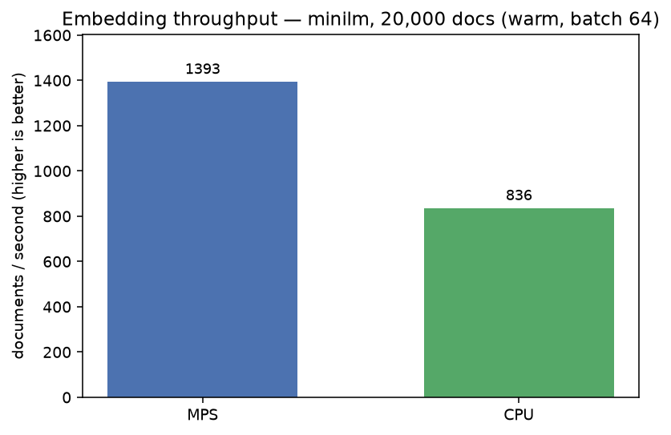

# Benchmarks

LodeDB does two measurable things: embed text into vectors, and scan those vectors. The
launch path is the CUDA direct TurboVec sweep: batched `search_many` queries can use the
optional GPU-resident scan, while single queries and unavailable GPU paths use the compact
CPU scan. All benchmark artifacts are metrics-only: counts, bytes, latency, ids, and backend
labels, never raw documents, queries, chunks, embeddings, or credentials.

Provenance is tagged inline: `measured` = timed on the stated machine; `recorded` = read
from the environment. No estimates.

## Native-core migration baselines

The native-core migration benchmark harness lives in
[`benchmarks/native_migration/`](../benchmarks/native_migration). It records import/open,
storage/WAL, lexical/hybrid, filter-planner, and TurboVec-adapter smoke measurements using
deterministic fixture corpora. The committed smoke artifact is
[`benchmarks/native_migration/results/baseline_smoke.json`](../benchmarks/native_migration/results/baseline_smoke.json).

Run the baseline bundle from the repo root:

```bash
PYTHONPATH=.:src LODEDB_ALLOW_MOCK_TURBOVEC=1 \
  uv run python -m benchmarks.native_migration.run
```

Current default-native verification is narrower than final runtime removal: fresh vector-only
handles can execute through native core by default when the bundled extension is available, while
Python remains the durable oracle and existing stores fall back to Python. Focused verification:

```bash
PYTHONPATH=.:src LODEDB_ALLOW_MOCK_TURBOVEC=1 uv run pytest -q \
  tests/test_native_core_flags.py \
  tests/test_native_core_shadow_vector_store.py \
  tests/test_vector_only_index.py \
  tests/test_local_vector_in.py \
  tests/test_import_boundary.py
```

## Launch benchmark: direct CUDA batch sweep

The LodeDB-owned launch proof lives in
[`benchmarks/direct_gpu_sweep/`](../benchmarks/direct_gpu_sweep). It builds one local
LodeDB index, runs paired CPU/GPU rows across batch sizes, and asserts the behavior the
README promises:

- batch 1 stays CPU/bypassed,
- every eligible batch >= 2 uses `gpu_cupy_exact_direct` under `required`,
- `auto` falls back visibly on GPU memory rejection,
- `required` fails closed on GPU memory rejection,
- CPU/GPU document-recall gap stays within `0.002`,
- persisted artifacts pass the raw-payload audit.

Run the smoke and full Modal sweeps from the repo root:

```bash
modal run benchmarks/direct_gpu_sweep/modal_bench.py::smoke
modal run benchmarks/direct_gpu_sweep/modal_bench.py::smoke_a10
modal run benchmarks/direct_gpu_sweep/modal_bench.py::main \
  --out benchmarks/direct_gpu_sweep/results/results_l40s.json
modal run benchmarks/direct_gpu_sweep/modal_bench.py::main_a10 \
  --out benchmarks/direct_gpu_sweep/results/results_a10.json
```

The full sweeps use GovReport-shaped real documents, MiniLM embeddings, A10/L40S CUDA, and
batch sizes `1,2,4,8,16,32,64,128,256,512,1024`. The benchmark writes `summary.json` plus
one redacted row per policy/batch cell.

**Measured** on Modal A10 and L40S: both full GovReport5K sweeps passed the launch
assertions over 5,000 documents and 1,024 queries. Batch 1 reported `not_applicable`;
every batch >= 2 reported `gpu_stage_one_status=used` with
`stage_one_backend=gpu_cupy_exact_direct`; every CPU/GPU document-recall gap was `0.0`;
`auto` memory admission reported `memory_rejected`; and `required` memory admission failed
closed. Artifacts:
[`results_a10.json`](../benchmarks/direct_gpu_sweep/results/results_a10.json) and
[`results_l40s.json`](../benchmarks/direct_gpu_sweep/results/results_l40s.json).

The end-to-end batch p50 includes query embedding and result hydration, so use
`gpu_stage_one_search_ms` for the vector-scan proof:

| GPU | batch 2 GPU scan ms | batch 16 GPU scan ms | batch 64 GPU scan ms | batch 1024 GPU scan ms |
|---|---:|---:|---:|---:|
| A10 | 5.575 | 5.999 | 9.713 | 95.509 |
| L40S | 3.597 | 4.069 | 5.948 | 31.715 |

The launch figures (rendered by `benchmarks/direct_gpu_sweep/diagrams.py`):







`gpu_scan_ms` is the vector-scan proof (`gpu_stage_one_search_ms`); `batch_latency_ms` is
end-to-end (it includes query embedding and result hydration); `recall_parity` shows the
CPU/GPU document-recall gap staying within tolerance. Two more figures — `search_p50_ms`
and `memory_copy` (host→device transfer) — are in
[`benchmarks/direct_gpu_sweep/docs/`](../benchmarks/direct_gpu_sweep/docs).

## Laptop: embedding throughput + CPU scan latency

On Apple Silicon, embedding runs on the GPU (Metal/MPS); the TurboVec scan runs on the CPU
SIMD kernel (NEON) by default. (A first-class opt-in Apple-GPU scan exists but stays off by
default; see "Apple-GPU (MPS) vector scan" below. The CUDA launch sweep is the section above.)

**Machine** (`recorded`): Apple M1, macOS 26.5.1 (arm64); TurboVec native backend `neon`.
**Setup** (`measured`): `minilm` (all-MiniLM-L6-v2, 384-dim, 4-bit), 20,000 docs, 200 queries,
single run (model pre-warmed), embed batch 64. Reproduce with `python benchmarks/laptop/run.py`.

| embed device | backend | bulk index (docs/s)¹ | scan p50 / p95 (ms)² | query p50 / p95 (ms)³ |
|---|---|---:|---:|---:|
| `mps` | sentence-transformers | **1,393** | 0.25 / 0.41 | 8.42 / 9.58 |
| `cpu` | sentence-transformers | 836 | 0.22 / 0.25 | **5.73 / 7.68** |

¹ Warm `add_many` throughput — the embedding model is pre-loaded before timing, so this is
steady state, not the one-time model load. ² The TurboVec scan is the same
CPU/NEON kernel regardless of embed device, so the ~0.25 ms p50 is consistent across rows —
this is the database's own work. ³ Embed one query, then scan; this is what interactive,
one-query-at-a-time serving pays.




Reading: the **scan is sub-millisecond** and device-independent — that's LodeDB's job, and
it's fast. **MPS** leads bulk indexing (it's the GPU); for **single queries** the CPU is
actually a touch faster end-to-end here, because MPS pays a per-call dispatch overhead that
doesn't amortize over one query. Pick the embed device for your workload and re-measure on
your own hardware — these are single-run numbers on one machine.

### Apple-GPU (MPS) vector scan — first-class opt-in, off by default

The MPS exact scan (`lodedb.engine.mps_turbovec`) is selectable via
`LODEDB_MPS_DIRECT_TURBOVEC=auto|required`: dequantized fp16 rows live resident on the Apple GPU
and are scored with a batched matmul + `torch.topk`. It is **recall-correct** (exact scoring;
R@1 >= the NEON scan), but on the measured M1 it is **slower than the NEON CPU scan at every
batch size** (0.08x at batch 1 -> 0.53x at batch 1024), so NEON stays the default on Mac. The gap
narrows as batch grows, so a stronger Apple GPU (M-series Pro/Max, M5+) could move the crossover;
re-measure with
[`benchmarks/mps_vs_neon/`](../benchmarks/mps_vs_neon).

## Reference: augmented exact scan vs. vanilla CPU scan

This older reference benchmark compares the same TurboVec index under a coarse batch sweep.
Keep it for recall/memory/update context, but use the direct CUDA batch sweep above for the
launch claim and current GPU-direct policy.

The optional `[gpu]` extra adds a GPU-resident **exact** scan (`lodedb.engine.gpu_turbovec`):
every row is reconstructed once to fp16 on the GPU, and query batches are scored with a GEMM
plus a streaming device-side top-k. The benchmark compares it against the **vanilla TurboVec
CPU SIMD scan** over the same index — the same comparison the upstream TurboVec repo plots,
with the GPU path in place of FAISS.

**Measured** on Modal **A10** and **L40S** (CUDA), 100K vectors, 1,000 queries, k=64, median
of repeated passes. Recall uses real OpenAI-DBpedia embeddings (d=1536, d=3072) and GloVe-200.
Reproduce on any CUDA host — see [`../benchmarks/gpu_vanilla_vs_augmented/`](../benchmarks/gpu_vanilla_vs_augmented).

### Search speed — the win is batched

The GPU path scores via a batched GEMM, so its throughput climbs with batch size while the
CPU SIMD scan is batch-insensitive. d=1536, 4-bit, 100K, on the A10:

| batch | augmented GPU (q/s) | vs. vanilla CPU all-threads (≈8,497 q/s) |
|---:|---:|---:|
| 1 | 261 | 0.03× — latency-bound; use the CPU for single queries |
| 16 | 3,531 | 0.4× |
| 64 | 11,463 | 1.3× |
| 256 | 19,998 | 2.4× |
| 1024 | 24,037 | **2.8×** |

Crossover is ≈ batch 50. On an **L40S** the same sweep reaches **50,326 q/s at batch 1024 =
4.8×** the CPU baseline — the advantage scales with GPU class and would go further on an
A100/H100. Single queries and 2-bit codes favor the compact CPU scan (d=1536/2-bit is 0.8×),
so route single queries to the CPU and batches to the GPU.


### Recall — preserved

R@1-within-top-k, vanilla quantized scan vs. augmented GPU exact-reconstruction:

| dataset | 2-bit (vanilla / aug) | 4-bit (vanilla / aug) |
|---|---|---|
| openai-1536 | 0.884 / 0.887 | 0.964 / 0.964 |
| openai-3072 | 0.911 / 0.910 | 0.978 / 0.972 |
| glove-200 | 0.556 / 0.559 | 0.834 / **0.844** |

At d=1536/3072 the quantization error is negligible, so exact scoring doesn't move recall. At
GloVe d=200 — where the error is largest — exact reconstruction helps a little (+0.010 at
4-bit k=1). The GPU path's value is throughput, not a recall jump.


### Memory — the GPU's cost

The throughput is bought with memory: fp16-resident vectors are ~4× the compact codes
(d=1536, 4-bit: 3,072 vs. 768 bytes/vector).


### Update / persist — the CPU delta win

A separate augmentation, on the CPU side: applying 1,000 changed rows and persisting. The
vanilla full `.tvim` rewrite is O(N); the encoded-row delta export is O(changed) and stays
sub-millisecond regardless of corpus.

| corpus | vanilla full rewrite | augmented delta export | speedup |
|---:|---:|---:|---:|
| 100K | 42.4 ms | 0.25 ms | 173× |
| 500K | 190.4 ms | 0.24 ms | 782× |
| 1M | 404.9 ms | 0.31 ms | **1,308×** |


### Reference bottom line

- The **CPU delta-persistence** patch is a large, scaling win (173× → 1,308× from 100K → 1M).
- In this coarse reference sweep, the **GPU exact batched scan** runs ~1.4–2.8× the AVX-512
  CPU at batch ≥ 64 (more on a bigger GPU), with recall preserved. The newer direct sweep
  is the launch benchmark for batch >= 2 behavior.
- The two are complementary: the delta keeps the index cheap to update, the GPU path
  accelerates high-batch serving. Both are reproducible from
  [`../benchmarks/gpu_vanilla_vs_augmented/`](../benchmarks/gpu_vanilla_vs_augmented); the
  full chart set (parity, scaling) lives there too.
